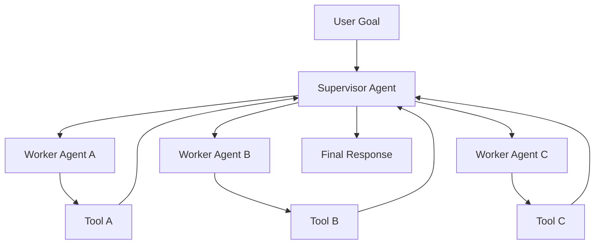
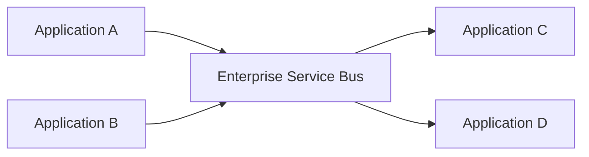

# Centralized Agent Orchestration Will Become Tomorrow’s Technical Debt


A user gives a **goal**. A **supervisor agent** decomposes it. **Worker agents** execute subtasks. **Tools** are called. Results come back. The supervisor reviews everything and produces the final answer.



This is the architecture many teams start with because it is easy to understand. It maps naturally to how organisations already think: managers delegate, teams execute, reviewers approve.

But this analogy is **dangerous**.

At enterprise scale, a **central orchestrator** is not just a coordinator. It becomes the place where **intent, context, authority, memory, policy, execution state, tool access, and completion logic** collapse into one reasoning loop.

That is not simply orchestration. That is a **cognitive control plane**. And cognitive control planes create a new kind of **technical debt**.

The debt does not appear in the **demo**. The demo looks impressive because the orchestrator can plan, delegate, recover, and produce an output.
The debt appears later, when the same system must **scale** across hundreds of tools, multiple data domains, sensitive workflows, regulated actions, audit requirements, and long-running business processes. A centralized orchestrator does not just coordinate these complexities. It **absorbs** them.

The problem is not that orchestration exists.

The problem is that we are hiding too much **architectural responsibility** inside one agent and making it a singular **choke point**. This is also contributing to the pattern that as more and more tools and other components are getting added to the centralized orchestration pattern, instead of having a performance rise, this system are having lower performace. 

This is why many **agentic AI projects** are likely to struggle after the prototype stage. Gartner predicted that more than **40%** of agentic AI projects would be cancelled by the end of 2027 due to escalating costs, unclear business value, or inadequate risk controls. Many agentic systems will not fail because the model cannot produce text. They will fail because the surrounding **execution architecture** cannot manage cost, authority, risk, reliability, and business value at scale.


## What Is Centralized Agent Orchestration?

Centralized agent orchestration is the pattern where one supervisor, planner, manager, or controller agent owns the workflow. It decides what needs to happen, decomposes the task, sends subtasks to other agents or tools, gathers results, resolves conflicts, and determines when the work is complete.

In simple cases, this pattern works well.

For example:

```
Goal: Write a product summary

Orchestrator:
- asks one agent to analyse customer needs
- asks another agent to compare competitors
- asks another agent to draft the summary
- combines the result
```
For a bounded, low-risk, reversible workflow, this is reasonable.

But enterprise systems are not just summarisation pipelines. They involve permissions, data residency, policy interpretation, operational risk, human approval, financial impact, customer records, infrastructure changes, and compliance obligations.

The moment the orchestrator becomes responsible for all of these, it stops being a helper and becomes an architectural liability.

Microsoft’s guidance on AI agent design already recognises that coordination challenges become most significant at the multi-agent level, where orchestration adds complexity around workflows, state, latency, and coordination. That is the first warning sign.

The second warning sign is harder to see: once orchestration becomes powerful, teams keep adding responsibility to it which also increase technical debt for future AI. 

## Why This Becomes Technical Debt

Technical debt is not just bad code. It is any **design shortcut** that makes future change, control, verification, or evolution harder.

Centralized orchestration is attractive because it gives a quick path to working demos. One agent can appear to coordinate everything. But this convenience creates **hidden debt** in six areas.

| Debt Type          | What Happens Today                                                              | What Breaks Tomorrow                                                                    |
| ------------------ | ------------------------------------------------------------------------------- | --------------------------------------------------------------------------------------- |
| Context debt       | The orchestrator receives more context so it can coordinate better              | Sensitive, stale, irrelevant, and conflicting context accumulates in one reasoning loop |
| Authority debt     | The orchestrator gets broad permissions to call tools and delegate tasks        | Least privilege collapses and one compromised agent can do too much                     |
| State debt         | Plans, retries, memory, and completion decisions live inside orchestration flow | It becomes difficult to reconstruct why something happened                              |
| Policy debt        | Governance becomes prompt instructions, guardrails, or runtime glue             | Auditors cannot verify that policy was enforced consistently                            |
| Integration debt   | Every tool and agent integrates through the orchestrator                        | The orchestrator becomes a cognitive monolith                                           |
| Observability debt | Logs show messages and tool calls                                               | They do not show which decision influenced which action under which authority           |


This is why centralized orchestration creates tomorrow’s technical debt.

## The Enterprise Service Bus Problem, But Worse
The enterprise service bus was introduced to simplify integration. Instead of every system connecting to every other system, the ESB became the central place where routing, transformation, policy, and integration logic lived.


At first, this looked clean. Over time, many ESBs became bottlenecks. Too much logic moved into the middle. Too many teams depended on the same integration layer. Change became slow. Ownership became unclear. Failure became centralised.

The orchestrator agent centralises reasoning, context, authority, policy interpretation, memory, and action.

OWASP describes “Excessive Agency” as a vulnerability where damaging actions can be performed because an LLM-based system has too much autonomy, permission, or tool access in response to unexpected, ambiguous, or manipulated outputs.

A central orchestrator naturally pulls systems toward excessive agency because it needs broad access to coordinate effectively.

That creates a **dangerous trade-off**:

> To coordinate better, the orchestrator asks for more **context** and more **authority**.
> The more context and authority it receives, the harder it becomes to **govern safely**.

## The Industry Is Already Moving Beyond the God-Agent

The interesting part is that leading AI labs and platforms are already moving away from the simplistic picture of one visible orchestrator controlling everything.

Not always explicitly. Not always with the same language. But the direction is visible.

### Anthropic’s C Compiler Experiment

Anthropic’s C compiler experiment is a useful signal. In that project, multiple Claude sessions worked in parallel on a compiler. Coordination happened through shared project state, Git synchronization, and task locks. Claude sessions claimed work by writing lock files under current_tasks, and Git synchronization helped prevent two sessions from taking the same task.

That is important.

The interesting part is not only that Claude helped build a compiler. The interesting part is the coordination model.

It did not look like one all-knowing supervisor agent managing every detail. It looked more like distributed software work:

```
Shared repository
Task files
Locks
Branches
Merge discipline
Tests
Local progress
External synchronization
```
The lesson is not “there is no orchestration.” There is orchestration. But it is distributed across model behaviour, repository state, file conventions, execution discipline, and verification loops.

## Google Scion
Google’s Scion is perhaps the clearest signal that agent execution is becoming runtime infrastructure. Scion is described as an experimental multi-agent orchestration testbed for concurrent LLM-based agents running in containers across local machines and remote clusters. It gives agents isolated identities, credentials, and workspaces, and supports a dynamic graph of parallel execution.

That looks less like chatbot orchestration and more like operating-system thinking.

```
Containers
Isolation
Credentials
Workspaces
Parallel execution
Runtime management
```

This reinforces the central argument:

> The future of agentic systems will look less like **one boss agent** and more like **distributed execution infrastructure**.

## The Shift in Design Principle  

Enterprise agentic architecture should move from **centralized cognitive control** to **bounded, governable influence**. The future of enterprise agentic architecture is not “more agents.” It is **better orchestration discipline**. Before we split a workflow into many agents, we must ask whether the work is truly decomposable, whether parallel reasoning adds value, and whether coordination overhead creates more risk than intelligence.

The future architecture should separate reasoning, execution, communication, and governance. 

efore choosing an orchestration pattern, ask a simpler question:

> Do we really need **multiple agents** for this task?

Many agentic systems start with a planner agent, researcher agent, tool agent, reviewer agent, critic agent, and synthesizer agent. The diagram looks sophisticated, but the design may be unnecessarily fragmented.

Google Research’s work on scaling agent systems makes this point clearly: multi-agent systems can help when work is parallelizable, but they can hurt sequential workflows. Their experiments showed strong gains for centralized coordination on a parallel financial reasoning task, but significant degradation for multi-agent variants on strictly sequential planning tasks. The lesson is simple: **more agents do not automatically mean better performance**.

A better default is:

> Start with **one capable agent**. Add more agents only when the **task structure** demands it.

For a golden path, a single agent is often better. If the workflow is known, sequential, repeatable, and depends on one coherent reasoning thread, splitting it into many agents adds unnecessary cost.

A single agent is usually enough when:

```text
The task follows one main reasoning path
The steps are sequential
The tool set is small
The context must stay coherent
The success condition is clear
The workflow is already known
```
So the first principle is:
> Do not create an **agent boundary** where a tool call, function, workflow step, or internal reasoning state is enough.

Separate agents only when there is a real separation of concern:

```
The work can run in parallel
Different expertise is needed
Different tools or permissions are needed
Independent verification is valuable
Failure needs to be isolated
The task can be decomposed without losing coherence
```
Only then should we ask whether orchestration is needed.

And even then, centralized orchestration should not be the **automatic answer**.

Centralized orchestration can be useful when workers need validation, outputs need synthesis, or errors need to be contained. Google’s research also found that centralized orchestration can reduce error amplification compared with fully independent multi-agent systems.

But the orchestrator must stay **narrow**.

It should **coordinate**, not absorb every responsibility.

The problems begin when the orchestrator becomes the planner, router, tool selector, memory holder, ambiguity resolver, conflict manager, and completion judge.

That creates common **failure modes**.

### 1. **Tool affinity**

The orchestrator may overuse familiar tools or previously successful paths, even when a simpler or safer option exists.

The orchestrator does not always choose the best tool.
It may choose the tool path it has learned to prefer.

### 2. **Ambiguous routing**

With many agents and tools, routing becomes its own reasoning burden.

The orchestrator must decide who should act, which tool should be used, whether the task needs research, planning, execution, review, or escalation. For golden-path workflows, this can be worse than a deterministic path.

### 3. **Cognition overlap**

Multiple agents may repeatedly reinterpret the same task.

Planner reframes the task
Researcher reframes the task
Tool agent reframes the task
Reviewer reframes the task
Orchestrator synthesizes again

This can look like robustness, but often it is duplicated cognition. For sequential work, it can reduce coherence. 
The same reasoning problem is solved repeatedly in slightly different ways. Each agent introduces its own assumptions. The orchestrator then has to reconcile outputs that should never have diverged in the first place.

This creates cognition overlap:

> Multiple agents are not collaborating; they are redundantly reinterpreting the same problem.

For sequential tasks, this can damage coherence. Google’s findings on sequential workflows are important here because they suggest that communication and coordination overhead can fragment reasoning and reduce performance when the task requires a tight sequence of dependent steps.

### 4. **Coordination tax**

Every additional agent adds a tax.

```
Prompt tax
Context transfer tax
Routing tax
Latency tax
Memory alignment tax
Debugging tax
Evaluation tax
Failure recovery tax
```
This tax is acceptable only when the value of specialization or parallelism is higher than the cost of coordination.

For parallel financial analysis, separate agents may examine revenue, cost, market, and risk at the same time. That can create real value.

For a sequential workflow with one golden path, the same decomposition may make the system slower, more expensive, and less reliable.

The design principle should be:

> Add agents only when the task structure pays for the **coordination tax**.

### 5. **Orchestrator overload**
A centralized orchestrator is useful when it has a narrow job: delegate, validate, and synthesize.

It becomes fragile when it is expected to act as planner, router, memory manager, tool selector, conflict resolver, policy interpreter, evaluator, and final decision-maker.

At that point, the orchestrator becomes another overloaded component.

The failure is not that it coordinates.

The failure is that it accumulates too many responsibilities.

A better orchestration design keeps the orchestrator **narrow**:


**Good orchestrator:**
- decomposes only when decomposition is justified
- routes only when routing adds value
- validates outputs against clear criteria
- synthesizes when synthesis is required
- avoids taking over every reasoning responsibility

**Bad orchestrator:**

- routes everything dynamically
- carries all shared context
- chooses all tools
- resolves all ambiguity
- owns all memory
- judges all completion
- becomes the only place where the workflow makes sense

A better set of principles would be:

1. Start with a single capable agent.
2. Identify whether the task is sequential or parallelizable.
3. Do not split a golden path unless decomposition creates measurable value.
4. Treat every new agent as a coordination cost.
5. Use separate agents only for real separation of concern.
6. Prefer deterministic workflow steps over agent routing when the path is known.
7. Keep centralized orchestration narrow.
8. Avoid making the orchestrator the owner of all reasoning.
9. Watch for tool affinity, ambiguous routing, and cognition overlap.
10. Choose architecture based on task structure, not agent-count enthusiasm.

The most important principle is this:

**Multi-agent architecture is not a maturity signal. It is a design trade-off.**

## Conclusion

A central orchestrator will appear to work because tasks are delegated, tools are called, outputs are produced, and the final response looks coherent. 

But underneath, context may be over-shared, authority may be over-concentrated, policy may be interpreted inside prompts, and completion may be declared by the same reasoning loop that performed the work.

Centralized orchestration will not disappear as a capability. It will increasingly be absorbed into the model, runtime, protocol, and execution substrate.

But **enterprise control** must not disappear with it. The architectural principle is simple:

> Do not centralize **cognition** and **control** in the same place.

## References

1. Anthropic, Building a C compiler with a team of parallel Claudes, 2026.
2. Anthropic, Introducing the Model Context Protocol, 2024.
3. Anthropic, Code execution with MCP: building more efficient AI agents, 2025.
4. [Google Scion](https://googlecloudplatform.github.io/scion/concepts/)
5. [Google Developers Blog, Announcing the Agent2Agent Protocol](https://developers.googleblog.com/en/a2a-a-new-era-of-agent-interoperability/), 2025.
6. Microsoft Azure Architecture Center, AI Agent Orchestration Patterns, 2026.
7. Gartner, Over 40% of Agentic AI Projects Will Be Canceled by End of 2027, 2025.
8. OWASP GenAI Security Project, LLM06:2025 Excessive Agency, 2025.
9. Google Research [Towards a science of scaling agent systems: When and why agent systems work](https://research.google/blog/towards-a-science-of-scaling-agent-systems-when-and-why-agent-systems-work/)