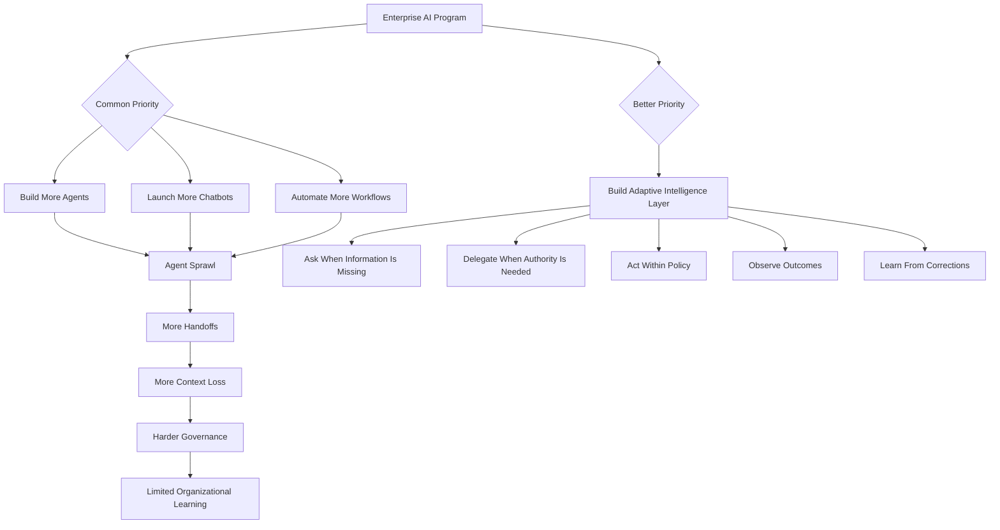
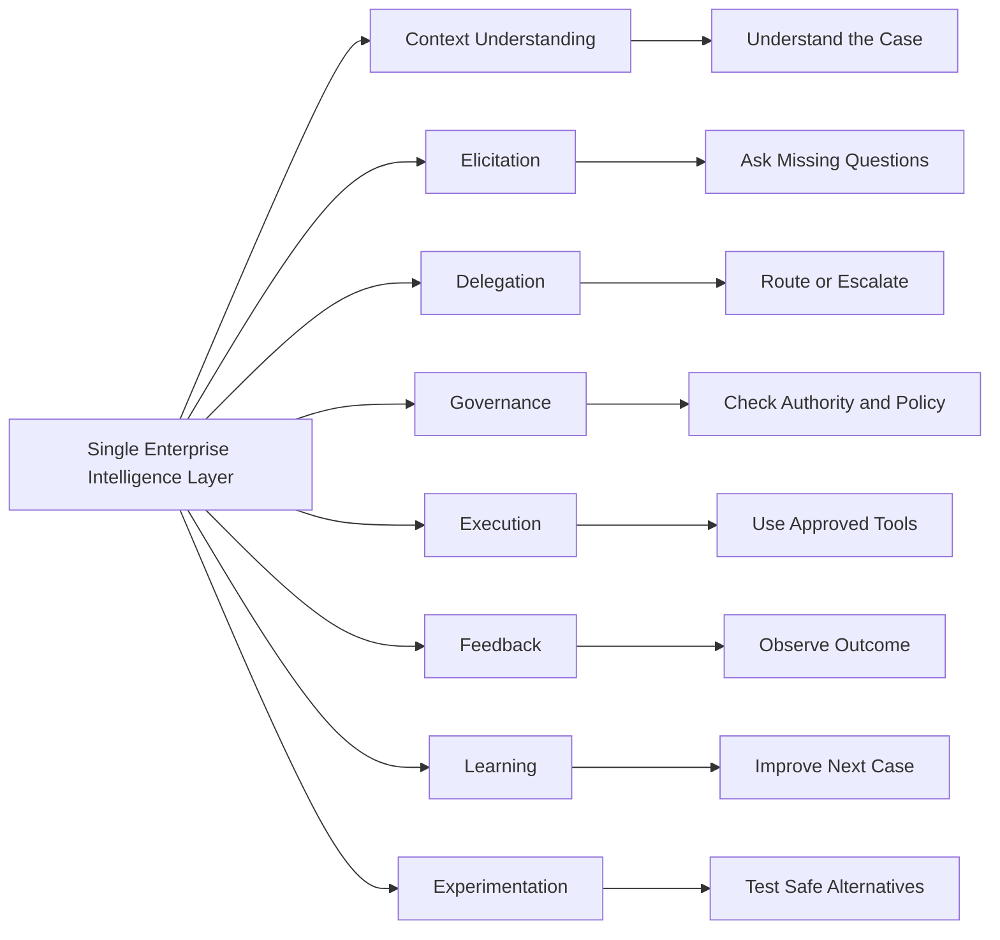
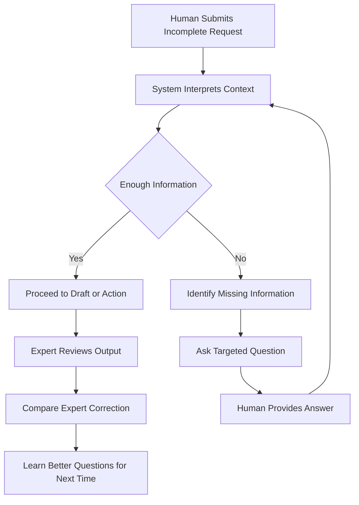
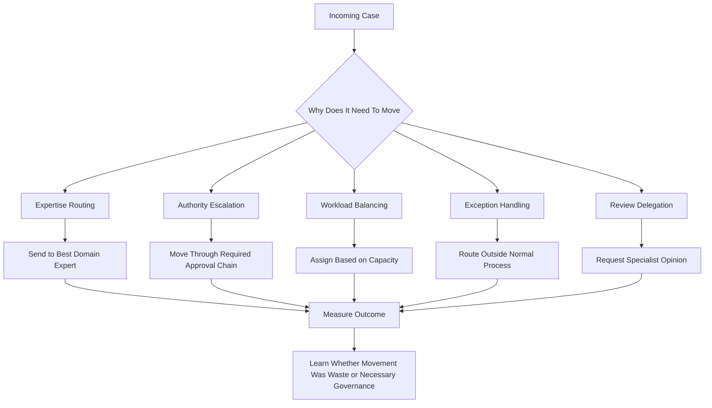
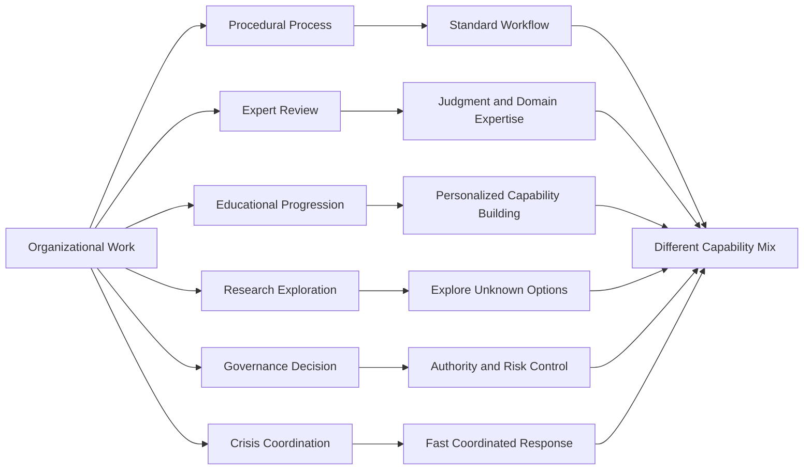
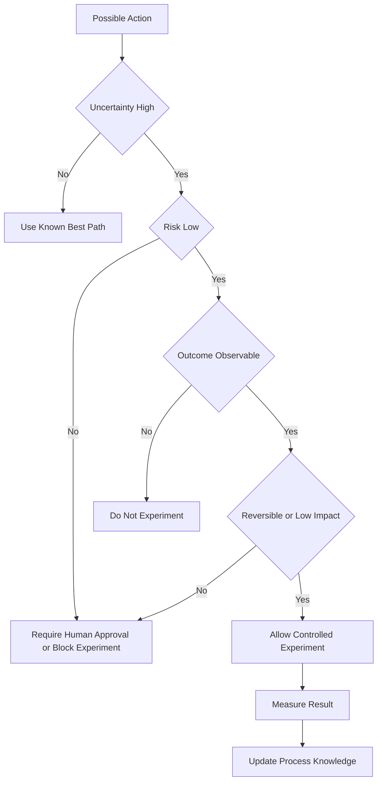
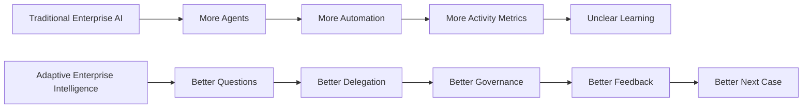

# The Enterprise Does Not Need More Agents

Every few years, the enterprise world discovers a new word that makes old problems sound new again.

A few years ago, everything became a platform. Then everything became digital transformation. Then everything became automation. Now everything is becoming an agent.

Procurement wants an agent. Legal wants an agent. HR wants an agent. Finance wants an agent. Engineering wants a coding agent. Operations wants a remediation agent. Leadership wants a dashboard that proves the company is now “AI-first.”

The demos are convincing. The architecture diagrams look modern. The internal roadmaps are full of agent names, agent workflows, agent supervisors, agent marketplaces, agent registries, and agent governance boards.

But something feels wrong.

The enterprise is not becoming more intelligent just because it has more agents. It may simply be recreating its existing bureaucracy in a new form, except now every handoff is wrapped in a prompt and every delay is hidden behind a model call.

This is where the current agent conversation starts to become dangerous. It takes a real organizational problem — how work moves, how decisions are made, how missing information is discovered, how people learn, how processes improve — and reduces it to a software pattern.

The question becomes, “How many agents do we need?”

That is the wrong question.

The better question is:

> What should the enterprise system be capable of doing when it does not yet know enough to act?

That question changes everything.

The enterprise does not need to become a marketplace of disconnected artificial workers. It needs a coherent intelligence layer that can support organizational judgment, not replace it with another layer of automation theater.

---

## The agent explosion will look productive before it becomes expensive

Most enterprise AI programs will not fail dramatically. They will fail quietly.

At first, they will look successful. Teams will build prototypes quickly. Internal demos will improve. The AI adoption dashboard will turn green. Someone will report that a process is now 40 percent faster. Someone else will report that a chatbot handled 70 percent of queries. A third team will say their agent reduced manual effort by half.

Nobody will ask what was measured. Nobody will ask whether the work actually disappeared or simply moved somewhere else. Nobody will ask whether the answer was correct, whether the process improved, whether the expert still had to fix the output, or whether the system learned anything from the correction.

That is exactly what can happen with agents.

A company may build twenty agents and still not know how to make one good decision. It may automate five approval flows and still not understand why approvals are slow. It may deploy an AI assistant to every employee and still not capture the knowledge that makes the organization work.

The agent count goes up. The intelligence of the organization does not.

This is the first trap: confusing the presence of agents with the presence of learning.

A business does not improve because a model produced an artifact. It improves when the next case is handled better because the previous case happened.

That distinction is easy to miss because automation has immediate visibility. Learning does not. A generated document appears instantly. A better decision habit takes time to observe. A routed ticket is easy to count. A reduction in unnecessary escalation is harder to prove. A chatbot conversation is easy to log. A change in organizational judgment is much harder to measure.

So the enterprise naturally drifts toward what is easiest to count.

Agents created.
Prompts used.
Workflows automated.
Hours saved.
Tickets handled.
Documents generated.

These are not meaningless metrics, but they are weak signals. They tell us that AI is being used. They do not tell us whether the organization is becoming more capable.

--- 

## A business does not need an agent for everything

If a system asks a clarifying question, we call it an explicate agent. If it routes a request, we call it a dispatch agent. If it checks progress later, we call it a feedback agent. If it applies policy, we call it a governance agent. If it compares outcomes, we call it an evaluation agent.

Very quickly, every useful capability becomes a separate agent.

That may sound elegant in a research diagram, but inside an enterprise it creates a coordination problem. Every new agent needs context. Every handoff risks losing meaning. Every decision requires tracing. Every failure becomes harder to debug because the system did not fail in one place; it failed somewhere between interpretation, delegation, memory, policy, and execution.

The more mature architecture is not “many agents talking to each other.”

The more mature architecture is a **single enterprise intelligence layer with many bounded capabilities**.

That layer may internally use different models, tools, services, skills, policies, workflows, evaluators, and human approval points. But the enterprise should not experience it as a crowd of artificial workers. It should experience it as one coherent system that understands the work.

This distinction matters because enterprises do not actually need a new artificial employee for every task. They need a system that can support the basic functions of organizational intelligence.

It must understand what is being asked. It must identify what information is missing. It must ask the right person for that information. It must know who has authority. It must know when to delegate. It must know when to escalate. It must act only within policy. It must observe the outcome. It must compare what happened with what should have happened. Then it must improve the next case.

That is not an agent swarm.

That is an **adaptive operating layer**.

---
## The real capability is not prompting. It is elicitation.

Most enterprise AI advice still puts too much responsibility on the human.

Write a better prompt. Add more context. Be more specific. Tell the model what role to play. Give examples. Ask it to think step by step.

This advice is useful, but it does not scale as an enterprise operating model.

Real work rarely begins with complete information. A project sponsor may not know what finance needs to approve funding. A customer may not know which technical detail matters. A student may not know which concept they failed to understand. A business user may describe a problem in the language of symptoms, not causes.

If the system depends on the human to provide the perfect prompt, then the system is not intelligent in any organizational sense. It is just waiting for a better user.

The enterprise system should not only answer. It should know when it does not have enough information to answer.

That is elicitation.

The goal is not to make humans better at feeding the AI.

The goal is to make the system better at discovering what it needs from humans.

## Delegation is not just routing

Enterprises also need to be careful with the word “dispatch.”

At first, dispatch sounds simple. A request comes in, and the system sends it somewhere. If the first recipient forwards it to someone else, the system learns that it should have routed it directly.

Sometimes that is true.

If a patent disclosure goes to Committee A and Committee A immediately forwards it to Committee B because Committee B owns that technology area, then the first routing was probably weak. The system should learn from that.

But not every transfer means the original decision was wrong.

If I ask my manager to approve a million-dollar project and my manager sends it to their boss, that does not mean the system should have skipped my manager next time. The manager may be part of the authority chain. Their role may be to validate, sponsor, challenge, or contextualize the request before it goes higher.

So delegation has different meanings.

Sometimes delegation is about expertise. Sometimes it is about authority. Sometimes it is about escalation. Sometimes it is about workload. Sometimes it is about risk. Sometimes it is about process legitimacy.

A naive AI system will treat every intermediate step as inefficiency. A mature enterprise system will ask why the intermediate step existed.
The goal is not to remove all handoffs. Some handoffs are waste. Others are governance. Some delays are bottlenecks. Others are necessary review. Some escalations reveal bad routing. Others reveal healthy accountability.

If the intelligence layer cannot distinguish these, it will optimize the organization in the wrong direction. It may make the process faster by removing the very steps that made the decision legitimate.

That is how AI creates invisible technical debt inside an organization. It does not break the process immediately. It removes the friction that was carrying context, judgment, or authority. The process still runs. The dashboard looks better. The damage arrives later.

---

## The business process model is too narrow
There is another problem hiding underneath all of this. We often talk as if every enterprise activity is a business process.

That works for expense approval, onboarding, procurement, ticket triage, legal review, and many other procedural flows. But it does not fully work for schools, research teams, design teams, invention programs, or executive decision-making.

A school is an organization, but learning is not just a workflow. A classroom may begin with a general lecture, then break into individual practice, then identify a few students who need targeted help, then return to group discussion. That is not a simple linear business process. It is an adaptive learning environment.

The same is true in research. Experimenting with alternatives to transformer architectures is not a normal process flow. It is exploration. Some experiments are cheap. Some findings are counterintuitive. Some paths should be exploited. Others should be explored just to build intuition.

If we force all of this into a rigid process model, the intelligence layer becomes too narrow. It will be good at automating forms and approvals, but weak at supporting discovery, learning, and adaptation.

This is why the enterprise should model work patterns, not just workflows.

Some work is procedural. Some work is exploratory. Some work is educational. Some work is governed by hierarchy. Some work is governed by expertise. Some work is creative. Some work is risky and must be tightly controlled. Some work is low-risk and should be used for learning.

A serious enterprise intelligence layer must understand these differences.

It should not treat a classroom, a patent review, a budget approval, a system incident, and a research experiment as the same kind of process.

They require different combinations of elicitation, delegation, feedback, governance, experimentation, and human judgment.

## Every action can become an experiment, but not every experiment is safe
One of the strongest ideas in this discussion is that every action the system takes can become an experiment if the system can judge the quality of the result.

That is powerful, but it is also dangerous.

If the system is uncertain whether to send a case to Committee A or Committee B, and the decision is very close, perhaps it should sometimes send the case to B. Maybe B will resolve it faster. Maybe B will produce a better review. Maybe B will forward it back. Either way, the system learns.

This is exploration versus exploitation applied to organizational life.

But enterprises are not video games. Exploration has a human cost. It can waste time. It can annoy experts. It can delay decisions. It can create fairness concerns. It can expose sensitive information. It can route work through the wrong authority path.

So the enterprise needs a theory of safe experimentation.

A safe experiment is not just an A/B test. It is an action where the downside is bounded, the decision is reversible or low-impact, the learning value is clear, the outcome can be observed, and the affected people are protected.

This matters because AI systems will otherwise learn in the wrong places.

It may be fine to experiment with the ordering of practice problems for students. It may be fine to test two internal summary formats. It may be fine to route a low-risk disclosure to a near-equivalent committee when the expected cost is small.

It is not fine to experiment casually with legal filings, high-value approvals, medical recommendations, employee performance decisions, or irreversible external actions.

This is where governance must become more than a policy document. Governance should define where the system is allowed to learn.

---

## What the enterprise should prioritize instead

If the enterprise wants to become AI-first in a serious way, it should not begin by asking every team to build agents.

It should begin by building the shared capabilities that make intelligence useful across processes.

The first priority is context understanding. The system needs to know what kind of work it is looking at. Is this an approval? A review? A learning moment? A research exploration? A customer issue? A compliance risk? A request for action? Without this classification, everything becomes a generic chat interaction.

The second priority is elicitation. The system must know when information is missing and how to ask for it. This is where many enterprise workflows fail today. The process does not break because no one can generate a document. It breaks because the right information was never captured at the right moment.

The third priority is delegation logic. The system must understand the difference between expertise routing, authority escalation, workload balancing, exception handling, and review delegation. If it treats all routing as the same, it will optimize the wrong thing.

The fourth priority is feedback instrumentation. Every meaningful action should produce a learning signal. If the system cannot observe outcomes, it cannot improve. It will keep generating plausible outputs and never know whether they mattered.

The fifth priority is decision lineage. The enterprise must know why the system asked a question, why it routed a case, why it escalated, why it acted, and why it stopped. Without lineage, AI becomes impossible to audit and difficult to trust.

The sixth priority is governance. Not governance as a committee that reviews the architecture once. Governance as a runtime property of execution. The system must know what it is allowed to do, under whose authority, with what evidence, and within what boundary.

The seventh priority is safe experimentation. The system should learn from near-calls and low-risk alternatives, but only where the cost is acceptable and the outcome can be measured.

The eighth priority is institutional memory. The organization must remember what happened before. Not just documents, but decisions, corrections, exceptions, reviewer preferences, failed routes, successful interventions, and expert judgments.

These are the foundations.

## The future is not prompt skill. It is organizational learning skill.

There is a simple version of the enterprise AI story where everyone becomes more productive because everyone learns to write better prompts.

That story is already outdated.

The next version is not about prompts. It is about skills.

Enterprises are beginning to ask employees to convert their judgment, experience, domain knowledge, and decision patterns into reusable AI skills. A finance expert turns review logic into a skill. A lawyer turns contract judgment into a workflow. A senior engineer turns debugging intuition into a runbook. A product manager turns market sense into a structured agent capability. A patent expert turns invention review into claim-drafting guidance.

On paper, this is a good idea.

Organizations should not lose critical knowledge every time a senior person leaves. Expert judgment should become more accessible. Reusable skills can reduce repeated work, improve consistency, and help junior employees operate with better guidance. In that sense, I agree with Han Lee’s point that the “Let a Hundred Skills Bloom” movement is not just about using AI more; it is about making human expertise legible to machines.

But that is also exactly why it is sensitive.

When an enterprise asks employees to distill what they know into AI-executable skills, it is not simply asking them to improve productivity. It is asking them to convert personal expertise into organizational infrastructure.

That creates a trust problem.

If I document the judgment that makes me valuable, do I become more influential or more replaceable? If I encode the edge cases that only I know, does the organization reward me for building leverage, or does it treat my knowledge as extracted capital? If I create the best skill in my function, have I made the organization better, or have I automated the reason the organization needed me?

This is why a “hundred skills” strategy can go wrong.

Employees may create performative skills that demo well but omit the hardest 20 percent. They may encode workflows that only work when they remain nearby to interpret the exceptions. They may turn skills into new forms of dependency rather than genuine organizational learning. They may participate just enough to satisfy the AI adoption dashboard, while protecting the tacit knowledge that actually makes the work succeed.

That is not because employees are irrational. It is because the incentive model is unclear.

So the enterprise should not treat skill creation as another adoption campaign. It should not say: everyone must publish five AI skills this quarter. That will produce quantity, not trust. It will create a marketplace full of fragile skills, duplicated workflows, hidden assumptions, and political self-protection.

A serious enterprise skill strategy needs a different social contract.

The organization must make it clear that skill distillation is not a replacement exercise. It is a capability-building exercise. The people who encode valuable expertise should gain recognition, ownership, influence, and career leverage. Their skills should be maintained, evaluated, versioned, and improved like important enterprise assets. The goal should not be to drain expertise out of people. The goal should be to let experts scale their judgment without making themselves disposable.

This is also why the intelligence layer matters.

If every skill becomes a disconnected agent, the enterprise gets another form of sprawl. But if skills become bounded capabilities inside a governed learning system, they become much more useful. The system can know when to invoke a skill, when the skill lacks enough context, when to ask the human expert, when to compare the skill’s output against expert correction, and when to update the skill based on what happened.

That is the difference between a skill library and an organizational learning system.

A skill library says:

“Here are reusable things people built.”

A learning system says:

“Here is what the organization knows, when that knowledge applies, when it fails, who owns it, how it improves, and what evidence proves it works.”

That is the shift enterprises should prioritize.

Not prompt engineering.

Not agent proliferation.

Not a hundred disconnected skills blooming without soil, governance, incentives, or feedback.

The enterprise should let skills bloom, but it must also build the garden: ownership, evaluation, trust, governance, feedback, and learning loops.

Otherwise, the flowers will bloom with thorns.

---
## The real test

A year from now, many companies will be able to say they deployed agents.

That will not be impressive.

The real test will be whether those systems made the organization better.

Did they reduce rework? Did they improve decision quality? Did they capture expert judgment? Did they ask better questions? Did they route work more intelligently? Did they protect authority boundaries? Did they learn from corrections? Did they improve people, not just processes? Did they know when not to act?

If the answer is no, then the enterprise did not build intelligence.

It built automation with better branding.

The agent count will not matter. The prompt library will not matter. The internal marketplace will not matter. The adoption dashboard will not matter.

What will matter is whether the next case is handled better because the previous case happened.

That is the standard.

Not more agents.

A better learning system.

> This article is inspired by [The AI Great Leap Forward](https://leehanchung.github.io/blogs/2026/04/05/the-ai-great-leap-forward/)