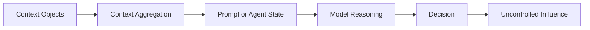
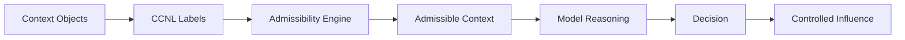

# Causal Context Nutrition Labels: Why AI Needs Context Admissibility

## Introduction
A common pattern in modern AI systems is to expand the model’s reasoning space with external context. Instead of relying only on model memory, systems retrieve documents, call tools, inspect databases, read long-term memory, search the web, and combine these signals into a single working context.

This pattern is powerful because it makes AI systems more current, more capable, and more connected to real workflows. But it also introduces a loophole: once something enters the reasoning context, the model may treat it as usable evidence. The system usually checks whether the context is relevant, but it rarely checks whether that context is allowed to influence the decision.

This assumption begins to break down when retrieved context contains noisy signals, proxy variables, stale memory, policy-restricted information, or historically biased patterns. In these situations, relevance alone is not sufficient justification for influence. A context object may help the model complete a task while still being causally inappropriate, unreliable, or unsafe to use for the decision being made.

A context object can be relevant and still be unsafe, misleading, noisy, policy-restricted, or causally inappropriate. In 2019, Obermeyer et al. showed that a widely used health-risk algorithm relied on healthcare cost as a signal for health need, which introduced racial bias because cost reflected unequal access to care, not only medical need. The algorithm did not need to explicitly use race for the decision to become harmful. The problem was that a context object with the wrong causal role was allowed to influence the outcome. [Obermeyer et al., 2019](https://www.science.org/doi/10.1126/science.aax2342)

My mental model started with a simple discomfort: AI systems do not fail only because the model is weak; they fail because the wrong information is allowed to become influential. Every retrieved document, memory item, tool output, policy note, user instruction, or database result is not just “context.” It is a possible force acting on the decision. Yet most systems still ask only one question: “Is this relevant?” They rarely ask the more important question: “Should this be allowed to influence the outcome?”

That distinction changed the way I looked at RAG and agentic systems. A document may be useful for explanation but unsafe for decision-making. A variable may be statistically predictive but causally inappropriate. A tool result may be accurate but outside the policy boundary of the task. A memory item may be true but stale. So the problem is not simply retrieval quality, model alignment, or provenance. The deeper problem is that context enters the reasoning process without a clear statement of its permitted role.

This is where the idea clicked for me: context needs something like a nutrition label. Before the model consumes it, each context object should carry a small but explicit declaration of what it is, where it came from, what causal role it plays, how risky it is, and whether it is allowed to influence the decision. That is the intuition behind **Causal Context Nutrition Labels (CCNL)**. CCNL is not just another metadata layer; it is a way to turn context from passive evidence into a governed influence surface.

## What Is CCNL?

CCNL is a framework for governing context as a **causal influence surface**.

Instead of treating every retrieved document, memory item, tool result, or user-provided fact as equal evidence, CCNL asks a more disciplined question:

**What role is this context object allowed to play in this decision?**

A context object is not just text. It is a potential influence on the model’s reasoning.

For each context object, CCNL attaches a label such as:

- source
- semantic variable
- causal role
- influence mode
- permission
- sensitivity
- risk

In simple terms, the label says:

**This information exists, but here is how it may or may not influence the decision.**

That shift is important. Provenance tells us where information came from. Policy tells us whether it can be used. Causal reasoning tells us whether it is meaningful for a decision. CCNL brings these together into one runtime control mechanism.

## Why Current AI Systems Are Missing This Layer

Retrieval-augmented generation made AI systems more useful by allowing models to combine parametric memory with external documents. The original RAG work showed how models could use retrieved passages as non-parametric memory for knowledge-intensive tasks. [Lewis et al., 2020](https://arxiv.org/abs/2005.11401)

Agentic systems went further. ReAct-style systems interleave reasoning and action, allowing models to reason, call tools, observe results, and continue. [Yao et al., 2022](https://arxiv.org/abs/2210.03629)

But both patterns share a weakness.

They improve how context is acquired, but they do not fully govern how context is allowed to influence the decision.

A RAG system may retrieve noisy documents.  
An agent may prefer a familiar tool over the right tool.  
A memory system may surface stale information.  
A risk model may use a variable that is statistically predictive but causally inappropriate.  

The missing layer is not retrieval.  
The missing layer is **admissibility**.

## The Core Idea

In a standard system, the flow looks like this:

Everything flows into the model. The model may use it, ignore it, amplify it, or combine it with other signals. But the system does not explicitly ask whether each context object is allowed to influence the decision.

CCNL changes the flow:

The key transformation is:

$$
C \rightarrow (C, L) \rightarrow C^{*} \rightarrow Y
$$

Where:

- `$C$` is the original context set
- `$L$` is the label set
- `$C^{*}$` is the admissible context set
- `$Y$` is the final decision

The model no longer reasons over all available context. It reasons over context that has passed an admissibility check.

## How CCNL Works

A context object can be represented as:

$$
CO_i = \langle x_i, p_i, m_i \rangle
$$

where:

- `$x_i$` is the content
- `$p_i$` is provenance
- `$m_i$` is metadata

Existing provenance frameworks such as W3C PROV-O help describe where information came from and how it was produced. [W3C PROV-O](https://www.w3.org/TR/prov-o/) Policy frameworks such as ODRL define permissions, prohibitions, and obligations over content usage. [W3C ODRL](https://www.w3.org/TR/odrl-model/)

But provenance and policy alone do not say how a context object contributes to a model decision.

CCNL extends the representation:

$$
CO_i \rightarrow (CO_i, L(CO_i))
$$

A label may contain:

$$
L(c) = \langle source, variable, role, influence, permission, sensitivity, risk \rangle
$$

For example:

| Context Object | Role | Permission | Influence |
|---|---|---|---|
| Verified income | Cause | Allow | Full |
| Credit history | Cause | Allow | High |
| Postcode | Inadmissible proxy role | Restrict | None |
| Recent spending | Weak signal | Allow | Attenuated |

The admissibility engine then applies a projection:

$$
C \xrightarrow{\Pi_L} C^{*}
$$

Only context objects with acceptable roles and permissions enter the reasoning path.

## A Concrete Example: Credit Approval

Imagine a credit approval system receives four context objects:

$$
C_q = \{o_{\text{income}}, o_{\text{postcode}}, o_{\text{history}}, o_{\text{spending}}\}
$$

A conventional system may use all four. That creates risk. Postcode may appear useful, but it may encode structural patterns unrelated to individual creditworthiness. Spending may be relevant, but unstable or noisy.

CCNL labels the objects:

| Object | Label |
|---|---|
| Income | cause, high confidence, allow |
| Credit history | cause, high confidence, allow |
| Postcode | inadmissible causal role, restrict |
| Spending | weak signal, attenuate |

The admissible context becomes:

$$
C_q^{*} = \{o_{\text{income}}, o_{\text{history}}, o_{\text{spending}}\}
$$

Postcode is removed. Spending is not removed, but its influence is reduced:

$$
y = f_\theta(\{w_i \cdot o_i \mid o_i \in C_q\})
$$

This matters because not every risk should result in exclusion. Some context should be blocked. Some should be weakened. Some should be allowed fully.

## CCNL in an Agentic System

In an agentic system, context changes over time. The agent retrieves new information, calls tools, observes outputs, and updates its reasoning state.

CCNL applies at each step:

$$
C_t^{*} = \{o_i \in C_t \mid g(o_i, \ell_i, \tau_t) = 1\}
$$

The reasoning trajectory evolves as:

$$
H_{t+1} = \mathcal{R}(H_t, C_t^{*})
$$

That means new information does not automatically become usable just because the agent found it. Every new context object must pass through admissibility before it can influence reasoning.

mermaid
flowchart TD
    A[User Query] --> B[Active Context C_t]
    B --> C[CCNL Admissibility Engine]
    C --> D[Admissible Context C_t*]
    D --> E[Reasoning Operator R]
    E --> F[Updated Reasoning State H_t+1]
    F --> B

    G[Memory] --> B
    H[Tool Output] --> B
    I[Retrieved Evidence] --> B
    J[User Input] --> B

    C --> K[Blocked Context]
    C --> L[Attenuated Context]
    F --> M[Label Refinement Loop]
    M --> C

## Why We Should Pay Attention

The next generation of AI risk will not only come from bad models. It will come from **bad influence control**.

A model may be technically strong and still make poor decisions because the wrong context was allowed to shape its reasoning.

This is already visible in several patterns:

- RAG systems degrade when corpora become noisy, duplicated, stale, or contradictory.
- Agents develop tool affinity when historically frequent tools are selected over more appropriate tools.
- Memory-augmented systems may reuse outdated user information.
- Compliance-sensitive workflows may retrieve restricted information and accidentally include it in reasoning.
- Decision systems may rely on context objects that are predictive but not admissible.

The problem is not simply hallucination.  
The problem is uncontrolled influence.

## What CCNL Could Drive in the Future

CCNL points toward a different architecture for AI systems.

Instead of asking only:

**Did the model get the right answer?**

We also ask:

**Was the answer influenced by the right context?**

That shift could drive several future capabilities.

### 1. Influence-Aware RAG

RAG systems will need to move beyond retrieval relevance. The next generation of RAG should label retrieved context by role, reliability, risk, and permission before the model uses it.

### 2. Policy-Aware Agentic Systems

Agents should not simply call tools and consume results. Tool outputs should become labeled context objects with usage constraints.

### 3. Auditable Decision Trails

Decision logs should not only show what context was used. They should show what context was excluded, attenuated, or restricted, and why.

### 4. Safer Enterprise AI

Enterprise AI systems operate inside policy-heavy environments. CCNL gives architects a way to connect provenance, governance, and runtime reasoning.

### 5. Continuous Context Governance

Labels can improve over time. If a context object repeatedly causes unstable decisions, its confidence can be reduced. If a source is reliable, its influence can be increased. The learning loop improves future labels without weakening runtime controls.

## Why This Is Important

Today, most AI systems treat context like food without nutrition labels. Everything retrieved goes into the model’s cognitive diet. Some of it is healthy. Some of it is junk. Some of it is toxic. But the system often cannot tell the difference.

CCNL introduces the missing nutrition label.

It does not claim to solve all causality. It does not require a full structural causal model. It does something more practical: it creates a runtime interface between context and influence.

That interface matters because the future of AI will be context-heavy. Models will not operate alone. They will operate with memory, tools, documents, workflows, databases, and other agents. In that world, controlling the model is not enough. We must control what is allowed to influence the model.

## Opinionated Conclusion

The industry is still treating context as an asset. That is only half true.

Context is also a liability.

Every retrieved document, memory item, tool output, and user signal is a potential influence on a decision. If we do not label and govern that influence, we are building systems that look intelligent but inherit every hidden correlation, stale assumption, policy violation, and structural bias buried inside their context.

The next frontier of trustworthy AI is not just better prompts, better retrieval, or bigger context windows.

It is **context admissibility**.

The systems that win will not be the ones that retrieve the most context. They will be the ones that know which context deserves influence.

## References

- Obermeyer, Z., Powers, B., Vogeli, C., & Mullainathan, S. “Dissecting racial bias in an algorithm used to manage the health of populations.” Science, 2019. https://www.science.org/doi/10.1126/science.aax2342
- Lewis, P. et al. “Retrieval-Augmented Generation for Knowledge-Intensive NLP Tasks.” NeurIPS, 2020. https://arxiv.org/abs/2005.11401
- Yao, S. et al. “ReAct: Synergizing Reasoning and Acting in Language Models.” ICLR, 2023. https://arxiv.org/abs/2210.03629
- W3C. “PROV-O: The PROV Ontology.” 2013. https://www.w3.org/TR/prov-o/
- W3C. “ODRL Information Model 2.2.” 2018. https://www.w3.org/TR/odrl-model/
- Obermeyer et al., “Dissecting racial bias in an algorithm used to manage the health of populations,” Science, 2019. https://www.science.org/doi/10.1126/science.aax2342
- Guo et al., “Retrieval-Augmented Generation as Noisy In-Context Learning,” 2025. https://arxiv.org/html/2506.03100v3
- Lewis et al., “Retrieval-Augmented Generation for Knowledge-Intensive NLP Tasks,” 2020. https://arxiv.org/abs/2005.11401
- Yao et al., “ReAct: Synergizing Reasoning and Acting in Language Models,” 2022. https://arxiv.org/abs/2210.03629
- W3C PROV-O, “The PROV Ontology.” https://www.w3.org/TR/prov-o/
- W3C ODRL Information Model. https://www.w3.org/TR/odrl-model/