# Agentic Ecosystem Threat Model Overview

As organizations adopt multi-agent AI architectures, security risk shifts from single-model misuse to ecosystem-level failure modes across identity, communication, memory, and tool execution. This overview frames the agentic stack as an interconnected threat surface and provides a structured baseline for analyzing assets, adversaries, controls, and blast radius across layers.

## Scenario:
An enterprise deploys a multi-agent AI ecosystem where specialized agents (e.g., Data Analyst Agent, Code Generator Agent, Security Auditor Agent) collaborate to complete complex tasks. These agents communicate through a central orchestrator, share context via a common memory store, access external tools through MCP servers, and interact with third-party services. Each agent has different privilege levels and access scopes based on their function.

A typical workflow: User requests a data analysis → Orchestrator assigns task to Data Analyst Agent → Agent queries database via MCP tool → Agent requests Code Generator to create visualization → Code Generator accesses file system → Security Auditor validates output → Results returned to user.

## Threat Landscape:
The agentic ecosystem introduces multiple attack surfaces: agent impersonation, privilege escalation through agent chaining, context poisoning in shared memory, tool misuse through compromised agents, and lateral movement between agents. Unlike single-agent systems, multi-agent architectures amplify risks through trust relationships, shared resources, and complex communication patterns. An attacker compromising one agent can potentially pivot to others, manipulate shared context to influence decisions, or abuse tool access across the ecosystem.

## Assets (A):
* A01: Agent credentials and identity tokens (used for authentication between agents and services).
* A02: Shared memory/context store (contains conversation history, intermediate results, sensitive data).
* A03: Tool access permissions (MCP server connections, API keys, database credentials).
* A04: Agent decision logic and prompts (system instructions, role definitions, capability descriptions).
* A05: Inter-agent communication channels (message queues, event buses, RPC endpoints).
* A06: User data and task outputs (PII, business data, generated artifacts).

## Threat Actors (TA):
* TA01: External attacker exploiting agent endpoints or communication channels.
* TA02: Compromised agent acting as insider threat (via prompt injection or code vulnerability).
* TA03: Malicious agent operator with legitimate access attempting privilege escalation.
* TA04: Supply chain attacker injecting malicious code into agent dependencies or tools.
* TA05: Eavesdropper intercepting inter-agent communications.

## Security Controls (C):
* C01: Agent authentication and authorization – mutual TLS, JWT tokens, role-based access control.
* C02: Context isolation and encryption – separate memory spaces per agent, encrypt shared data.
* C03: Tool access governance – least privilege, approval workflows for sensitive operations.
* C04: Communication security – encrypted channels, message signing, replay protection.
* C05: Agent behavior monitoring – anomaly detection, audit logging, rate limiting.
* C06: Input validation and sanitization – prevent prompt injection across agent boundaries.
* C07: Capability boundaries – restrict agent actions to defined scope, sandbox execution.

## Zones:
* User Interface Layer (web/API gateway where users interact)
* Orchestration Layer (central coordinator managing agent lifecycle and task distribution)
* Agent Execution Layer (individual agent runtimes with isolated contexts)
* Shared Services Layer (memory store, message bus, authentication service)
* Tool Integration Layer (MCP servers, external APIs, databases)
* External Services (third-party APIs, cloud services)

```mermaid
flowchart TB
  classDef threatActor fill:#ffdddd,stroke:#ff0000,color:#000;
  classDef asset fill:#ffffcc,stroke:#999900,color:#000;
  classDef control fill:#ddffdd,stroke:#009900,color:#000;
  classDef system fill:#ffffff,stroke:#000000,color:#000;

  subgraph zone_user [User Interface Layer]
    style zone_user stroke:#0066cc,stroke-dasharray: 5 5;
    UserAPI[User API Gateway]:::system
    TA01[TA01: External Attacker]:::threatActor
  end

  subgraph zone_orchestration [Orchestration Layer]
    style zone_orchestration stroke:#0066cc,stroke-dasharray: 5 5;
    Orchestrator[Agent Orchestrator]:::system
    A04Logic[A04: Agent Decision Logic]:::asset
    C01Auth[[C01: Agent Authentication]]:::control
    C05Monitor[[C05: Behavior Monitoring]]:::control
  end

  subgraph zone_agents [Agent Execution Layer]
    style zone_agents stroke:#ff0000,stroke-dasharray: 5 5;
    AgentA[Data Analyst Agent]:::system
    AgentB[Code Generator Agent]:::system
    AgentC[Security Auditor Agent]:::system
    TA02[TA02: Compromised Agent]:::threatActor
    C06Validate[[C06: Input Validation]]:::control
    C07Sandbox[[C07: Capability Boundaries]]:::control
  end

  subgraph zone_shared [Shared Services Layer]
    style zone_shared stroke:#ff0000,stroke-dasharray: 5 5;
    MemoryStore[Shared Memory Store]:::system
    MessageBus[Message Bus]:::system
    A02Context[A02: Shared Context]:::asset
    A05Channels[A05: Communication Channels]:::asset
    C02Isolation[[C02: Context Isolation]]:::control
    C04CommSec[[C04: Communication Security]]:::control
    TA05[TA05: Eavesdropper]:::threatActor
  end

  subgraph zone_tools [Tool Integration Layer]
    style zone_tools stroke:#ff0000,stroke-dasharray: 5 5;
    MCPServer[MCP Tool Server]:::system
    A03Tools[A03: Tool Permissions]:::asset
    A01Creds[A01: Agent Credentials]:::asset
    C03Governance[[C03: Tool Access Governance]]:::control
  end

  subgraph zone_external [External Services]
    style zone_external stroke:#ff0000,stroke-dasharray: 5 5;
    ExternalAPI[Third-Party APIs]:::system
    Database[(Database)]:::system
    A06Data[A06: User Data]:::asset
    TA04[TA04: Supply Chain Attacker]:::threatActor
  end

  UserAPI --> Orchestrator
  Orchestrator --> AgentA
  Orchestrator --> AgentB
  Orchestrator --> AgentC
  AgentA <--> MessageBus
  AgentB <--> MessageBus
  AgentC <--> MessageBus
  AgentA --> MemoryStore
  AgentB --> MemoryStore
  AgentC --> MemoryStore
  AgentA --> MCPServer
  AgentB --> MCPServer
  MCPServer --> ExternalAPI
  MCPServer --> Database
  
  TA01 -. attacks .-> UserAPI
  TA02 -. impersonates .-> AgentB
  TA05 -. intercepts .-> MessageBus
  TA04 -. compromises .-> ExternalAPI
  
  C01Auth -. protects .-> Orchestrator
  C02Isolation -. secures .-> A02Context
  C03Governance -. restricts .-> A03Tools
  C04CommSec -. encrypts .-> A05Channels
  C05Monitor -. watches .-> AgentA
  C05Monitor -. watches .-> AgentB
  C05Monitor -. watches .-> AgentC
  C06Validate -. filters .-> MessageBus
  C07Sandbox -. limits .-> AgentA
  C07Sandbox -. limits .-> AgentB
  C07Sandbox -. limits .-> AgentC
```

## Key Risks:
1. **Agent Impersonation**: Attacker spoofs agent identity to gain unauthorized access to tools or data.
2. **Context Poisoning**: Malicious data injected into shared memory influences other agents' decisions.
3. **Privilege Escalation**: Low-privilege agent exploits orchestrator to access high-privilege tools.
4. **Lateral Movement**: Compromised agent pivots to attack other agents or services.
5. **Tool Abuse**: Agent with legitimate tool access performs unauthorized operations.
6. **Communication Interception**: Sensitive data leaked through unencrypted inter-agent messages.

## Mitigation Strategies:
1. Implement zero-trust architecture with continuous authentication and authorization.
2. Encrypt all inter-agent communications and shared memory at rest and in transit.
3. Use capability-based security model limiting each agent to minimum required permissions.
4. Deploy comprehensive logging and anomaly detection across all agent interactions.
5. Implement circuit breakers and rate limiting to prevent cascading failures.
6. Regular security audits of agent code, dependencies, and tool integrations.
7. Sandbox agent execution environments with network and file system restrictions.

## References:
1. [OWASP Top 10 for LLM Applications](https://owasp.org/www-project-top-10-for-large-language-model-applications/)
2. [NIST AI Risk Management Framework](https://www.nist.gov/itl/ai-risk-management-framework)
3. [Model Context Protocol Security Best Practices](https://modelcontextprotocol.io/specification/draft/basic/security_best_practices)