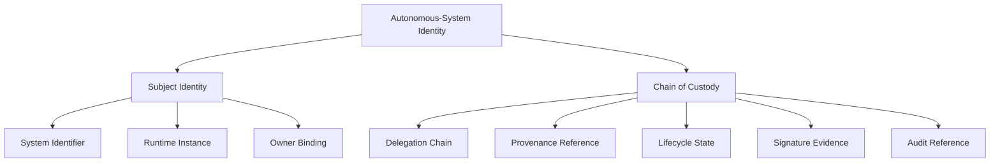
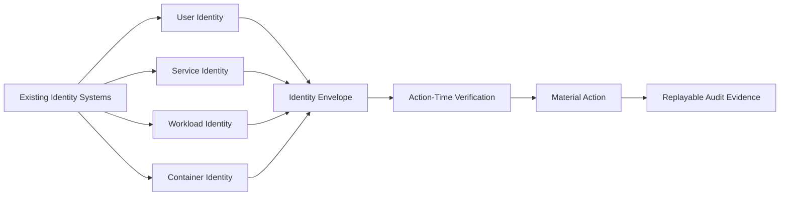
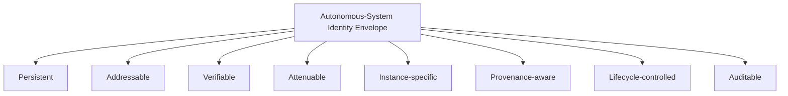
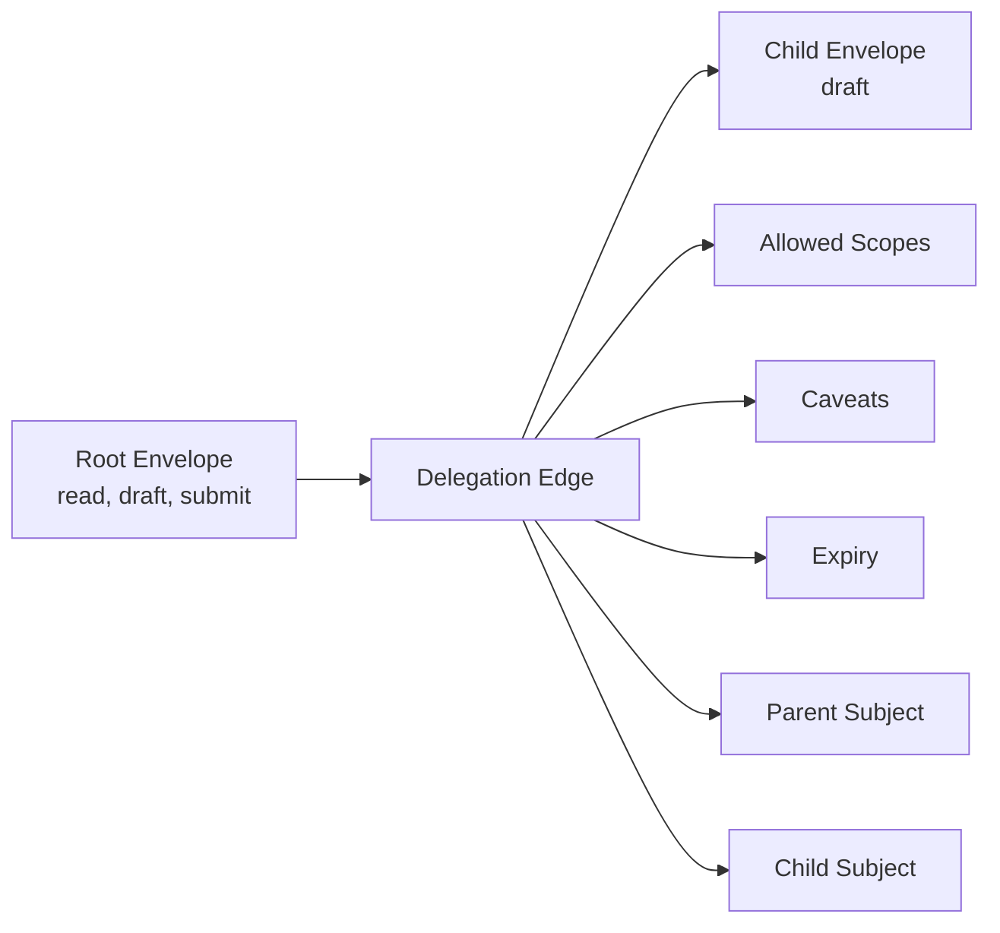
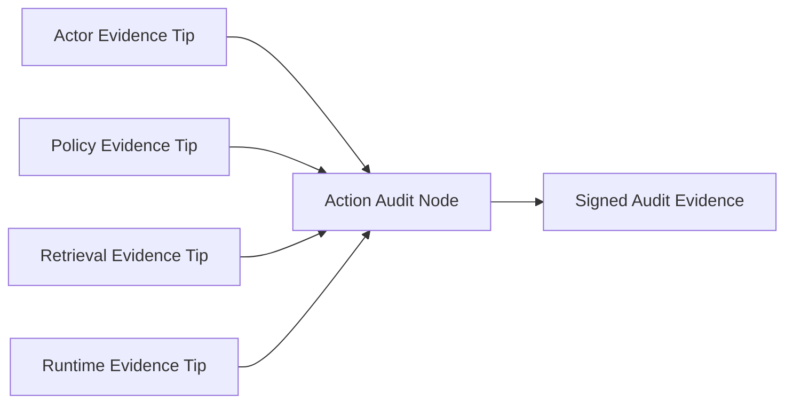
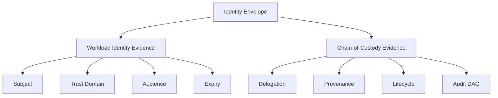
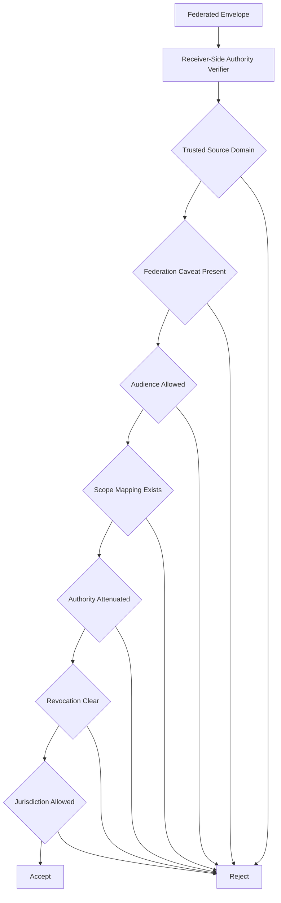

# The Missing Identity Layer for Autonomous Systems

Autonomous systems create a new identity problem.

Existing identity systems are good at naming and authenticating principals. A user identity can establish the human or organizational principal. A service identity can identify an application component. A workload identity can identify a deployed workload inside a trust domain. A container or pod identity can identify a concrete infrastructure instance.

These identities are necessary.

But autonomous systems introduce a different requirement. They do not only access resources. They interpret context, call tools, delegate work, persist state, resume later, and perform actions that affect other systems. They may act long after the original user instruction. They may pass authority to another component. They may use different tools depending on what they discover during execution.

So the identity question changes.

It is no longer only:

> Who is this subject?

It becomes:

> What is this autonomous system, under whose authority is it acting, from which runtime, with what provenance, through which delegation path, under what lifecycle state, and with what evidence?

That is the core thesis:

**Autonomous-system identity is only meaningful when it carries chain-of-custody evidence.**

A token can prove that a credential was issued. A workload identity can prove that a process belongs to a trust domain. A policy engine can decide whether a subject has permission. But an autonomous system needs a stronger object: one that binds identity, authority, runtime, provenance, delegation, lifecycle, cryptographic verification, and audit evidence.

That object is the **identity envelope**.

---

## Why existing identity subjects are not enough

Each existing identity type answers a useful question, but none of them fully answers the autonomous-system identity question.

| Identity type | What it identifies | Why it is not sufficient for autonomous-system identity |
| --- | --- | --- |
| User identity | Human principal such as an employee, customer, or administrator | Does not distinguish the autonomous system that later interprets, delegates, retries, resumes, or executes under delegated authority. |
| Service identity | Stable backend service or application component | Often too coarse; one service may host many agents, tenants, tasks, policies, tools, or delegated authorities. |
| Container or pod identity | Concrete runtime unit scheduled by infrastructure | Often ephemeral; useful for tracing but not durable across restarts, migrations, replicas, or long-running autonomous tasks. |
| Workload identity | Cryptographically identified workload within a trust domain | Identifies the running workload, but not necessarily the autonomous actor, owner, delegation chain, lifecycle state, provenance, or action-specific authority. |
| Autonomous-system identity | Persistent autonomous actor plus chain-of-custody evidence | Binds who the system is with how authority reached the action. |

---

## The gap appears when identity must explain action

The enterprise already has users, groups, roles, service accounts, API keys, workload identities, access tokens, certificates, policies, logs, and audit tools. Those controls are necessary.

The gap appears when an autonomous system starts acting across time, tools, runtimes, and delegated authority.

A token can say that a session was valid. A workload identity can say that a process belongs to a trust domain. A policy engine can say that a subject has a permission. A log can say that an action happened.

But an autonomous action needs a stronger explanation:

> Why was this autonomous system allowed to perform this action at this moment?

That question requires more than identity naming.

It requires chain of custody.

---

## Identity and chain of custody must travel together

Identity answers:

> Who or what is this system?

Chain of custody answers:

```text
How did this system receive authority?
Which runtime instance acted?
Which owner is accountable?
Which provenance is bound to the action?
Which delegation path was followed?
Which lifecycle state was checked?
Which evidence proves that the action was allowed?
```

For autonomous systems, these two ideas should not be separated. A system name without custody evidence is too weak. A custody trail without a stable identity is too hard to govern.



This is the shift.

Autonomous-system identity is not only a name. It is a verifiable chain of custody for action authority.

---

## Identity envelopes are the missing layer

The identity envelope is the missing layer between existing identity infrastructure and autonomous execution.

It does not replace user identity, workload identity, service identity, or policy engines. It composes with them.

The envelope gives autonomous systems an action-time evidence object. It carries the subject identity together with the custody trail that explains why the system may act.



Autonomous-system identity should not be a static label attached to an agent registry. It should be a portable evidence envelope verified at the point where authority is exercised.

---

## The eight properties of autonomous-system identity

A useful autonomous-system identity should have eight properties. These are not just metadata fields. They are design principles.

| Property | Meaning |
| --- | --- |
| Persistent | The system has a stable identity across sessions, restarts, and execution environments. |
| Addressable | Policies, logs, reviewers, and governance processes can independently refer to the system. |
| Verifiable | The identity claim is cryptographically verifiable and tamper-evident. |
| Attenuable | Delegation can reduce or preserve authority, but must not expand it. |
| Instance-specific | The identity distinguishes one runtime instance, deployment, environment, and region from another. |
| Provenance-aware | The identity can bind to code, model, configuration, policy bundle, or build evidence. |
| Lifecycle-controlled | The verifier checks whether the system is active, restricted, suspended, revoked, or retired. |
| Auditable | Material actions produce evidence that can replay why the action was allowed. |



The identity is governable only when these properties travel together.

---

## The identity envelope

The identity envelope is the object that implements the missing layer.

It should carry:

```text
system identifier
runtime instance
owner binding
attestation chain
provenance reference
lifecycle state
issued-at timestamp
verified-at timestamp
audit reference
signature chain
delegations
metadata
```

Each field exists because autonomous action creates a question.

```text
system identifier      -> who or what is acting?
runtime instance       -> which execution instance acted?
owner binding          -> who is accountable?
attestation chain      -> what supporting evidence is attached?
provenance reference   -> which code, model, policy, or build is bound?
lifecycle state        -> is the system still allowed to act?
signature chain        -> was the envelope tampered with?
delegations            -> how did authority move?
audit reference        -> can the decision be replayed?
metadata               -> what adapter-specific evidence is needed?
```

This is why the envelope is not just a token. A token often represents a claim. An envelope represents a claim plus custody evidence.

---

## Delegation is where custody becomes operational

A system may receive authority from a user, then pass part of that authority to another system. That is not wrong. It is necessary.

But the delegation path must be explicit.

The system should know who delegated, to whom it was delegated, which scopes were delegated, which caveats applied, when the delegation expires, and whether the delegation crossed a trust boundary.



The design principle is simple:

> An autonomous system can pass authority only by carrying the custody trail of how that authority was received.

That is the heart of the identity problem.

---

## Audit must be part of identity

Audit is often treated as something that happens after identity.

First we authenticate. Then we authorize. Then we log.

For autonomous systems, audit needs to be closer to identity. If a system acts autonomously, the enterprise must be able to reconstruct the evidence path later.

A normal log may say:

```text
agent-x called tool-y
```

A custody-aware audit record should help answer:

```text
which envelope was used
which runtime instance acted
which scope was required
which delegation chain applied
which lifecycle state was checked
which input and output were committed
which signature verified
which audit reference links the action to evidence
```

Logging tells us what happened.

Audit evidence tells us why the action was allowed to happen.

---

## Merkle DAGs fit the custody problem

Autonomous systems rarely act from one piece of evidence.

A material action may depend on the acting system, a policy verifier, a retrieval gate, a human approval, a runtime attestor, or a previous case state.

If we force this into a linear chain, we lose the real structure of the evidence.

A Merkle DAG is useful because an action node can commit to multiple parent hashes.



The DAG does not just say what happened before. It says which evidence was co-present when the action was committed.

That is closer to chain of custody and closer to how enterprise control actually works.

---

## Workload identity still matters

Chain of custody does not remove the need for workload identity.

A SPIFFE-style identity or SVID-style claim can answer important questions:

```text
which workload is this?
which trust domain does it belong to?
who signed the claim?
was it intended for this audience?
is the claim still fresh?
```

These are valuable properties, but they are not the full identity story for autonomous systems.

Workload identity tells us who the workload is. The identity envelope tells us how that workload is allowed to act.

The stronger pattern is composition.



SPIFFE/SVID-style evidence can provide freshness and trust-domain identity. Merkle-DAG evidence can provide custody and audit structure. The envelope binds them.

---

## Federation is custody across trust domains

Federation is often treated as a token verification problem.

A token comes from another domain. The signature verifies. The receiver accepts it.

That is not enough for autonomous systems.

When authority crosses a trust domain, the receiver needs to evaluate custody. It should ask whether the source trust domain is recognized, cross-domain delegation was explicit, the audience is allowed, the source scope translates into a receiver-local scope, the translated scope stays within delegated authority, revocation checks pass, the jurisdiction allows the action, and the decision can be audited.



The receiver should not accept authority just because a credential verifies. It should accept authority only when the custody chain makes sense under receiver policy.

---

## How the autonomous-identity library implements the architecture

The `autonomous-identity` library provides a reference architecture for this missing identity layer.

It implements the identity-envelope pattern as a concrete runtime model for autonomous-system authority. The library is built around six components.

### 1. IdentityEnvelope

`IdentityEnvelope` is the core object. It carries the autonomous system’s subject identity, runtime instance, owner binding, attestation chain, provenance reference, lifecycle state, timestamps, audit reference, signature chain, delegations, and metadata.

This object expresses the core thesis directly:

> autonomous-system identity equals subject identity plus chain-of-custody evidence.

### 2. IdentityAdapter

The adapter boundary keeps the envelope model separate from the cryptographic substrate.

Each adapter implements:

```text
issue
verify
delegate
revoke
audit
```

This means different evidence strategies can share the same identity pattern.

### 3. Action-time runtime facade

The runtime facade verifies the envelope before a material action runs.

It checks lifecycle state, delegation expiry, required scope, envelope validity, and adapter verification. Then it executes the action and writes audit evidence.

The pattern is:

```text
verify before action
execute only if valid
audit after action
```

### 4. Merkle-DAG adapter

The Merkle-DAG adapter supports custody evidence for graph-shaped workflows. It lets one action node commit to multiple parent hashes, which is useful when an action depends on multiple witnesses or controls.

### 5. Composite adapter

The composite adapter combines SVID-style evidence with Merkle-DAG evidence.

The SVID-style path contributes subject, audience, expiry, and commitment binding. The DAG path contributes node signature, parent hashes, and audit commitment.

Together, they provide a stronger identity-envelope construction.

### 6. Federation authority concept

The next design direction is receiver-side federation authority.

The idea is to move from:

```text
this federated credential verifies
```

to:

```text
this receiver accepts this authority for this action under this policy
```

That is the right direction for autonomous systems that operate across tenants, organizations, or platforms.

---

## Current boundary and next extensions

The current architecture is intentionally extensible.

It establishes the identity-envelope model, action-time verification, monotone delegation, lifecycle-controlled execution, pluggable cryptographic adapters, local audit evidence, and composite SVID plus Merkle-DAG evidence.

The next extensions are clear:

- recursive DAG closure verification,
- hardware-rooted runtime attestation,
- external SLSA or in-toto validation,
- receiver-side federation authority,
- formal analysis of minimal composite constructions.

The point is not that the first version solves every dimension of autonomous-system identity.

The point is that it defines the missing object: an identity envelope that carries both who the system is and how authority reached the action.

---

## The real test

The real test of autonomous-system identity is not whether the system has a name, a token, or a registry entry.

The real test is whether the enterprise can answer this after a material action:

> Why was this autonomous system allowed to perform this action at that moment?

A good answer should include the system identity, runtime instance, owner binding, lifecycle state, delegation chain, required scope, provenance reference, cryptographic evidence, and audit record.

If the system can answer that, it has autonomous-system identity.

If it cannot, then it has authentication around autonomous behavior.

The missing identity layer is the chain of custody between subject and action.

That is what identity envelopes provide.