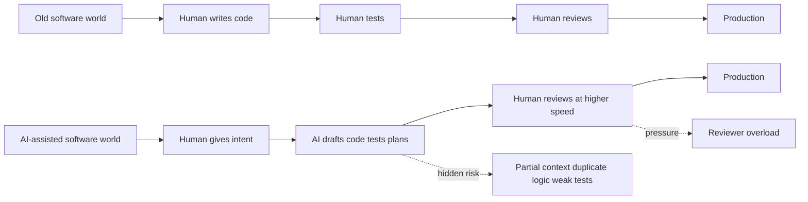
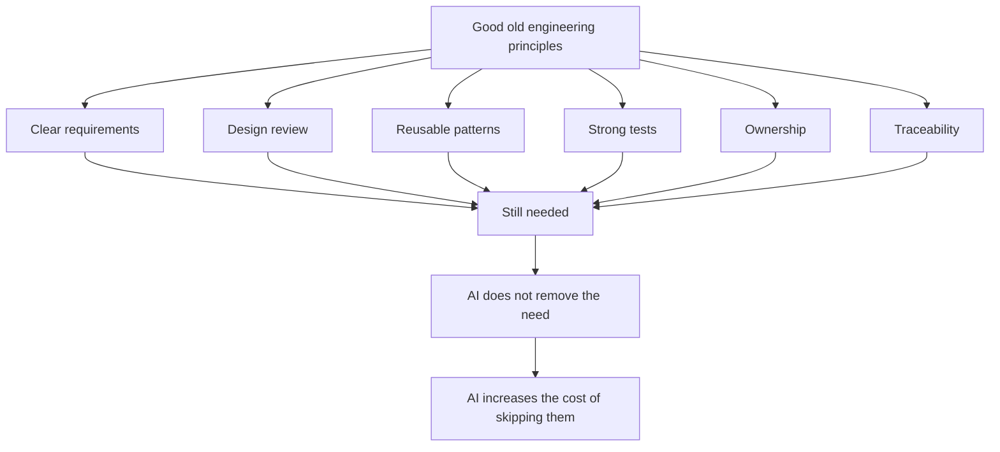
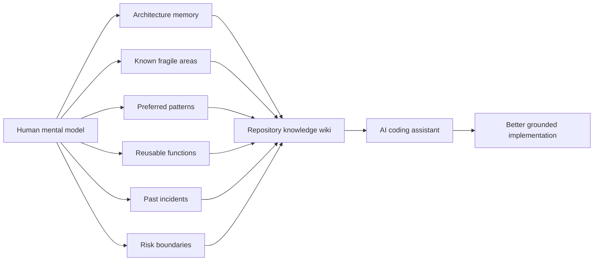
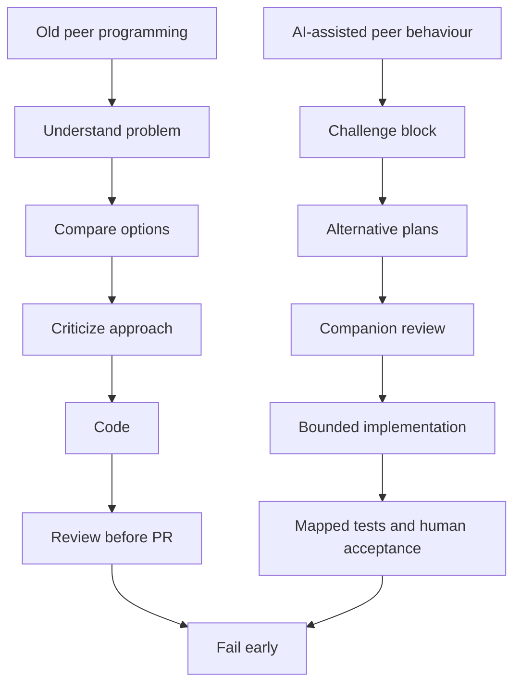
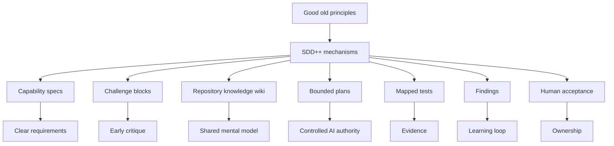

# When Code Gets Faster Than Engineering Discipline

<TldrCard title="TL;DR" read-time="~15 min · 4,200 words">

- AI coding assistants did not change what good engineering looks like — they changed how easily we can skip it without seeing the cost.
- The assistant does not carry the team's mental model by default. If it lives only in senior engineers' heads, the assistant will rebuild from a partial picture every session.
- "Keep a human in the loop" at PR time is not enough. The volume of generated code is outrunning review capacity, and the cost of catching a wrong direction at PR is already high.
- The real shift: quality has to be designed **into** the workflow — context before action, challenge before code, boundaries while building, evidence after building, and a human owner before shipping.
- If you only read a few sections: **What changed with coding assistants**, **Sharing the team's mental model**, and the **summary of new best practices** at the end.

</TldrCard>

This week I probably heard the phrase *spec-driven development* more than one hundred times.

And honestly, I am glad we are talking about it.

It is a very cool thing. It is also the right conversation to have right now because AI coding assistants have changed how software is being produced. But before we jump into another new framework, another new tool, or another new method, I think we need to pause and ask a very basic question.

What actually changed?

Because when we look closely, not everything changed.

A messy function did not suddenly become beautiful because an AI wrote it. A duplicated helper did not stop being technical debt because it was generated in ten seconds. A weak test did not become stronger because the assistant explained it confidently. An unclear requirement did not magically become clear because we gave it to a model instead of a developer.

<PullQuote>
Good code is still good code. Bad code is still bad code.
</PullQuote>

These problems were not invented by AI.

We had them in the human-only software world as well. We had unclear requirements. We had over-engineering. We had under-testing. We had outdated documents. We noticed that some developers didn't reuse existing functions. We had reviewers who missed edge cases because they were tired or overloaded.

So the story is not that AI created a completely new world.

The story is that AI added a new developer persona and changed the world's speed, scale, fragmentation, and trust model.

<AnnotatedFigure
  :number="1"
  caption="Two software worlds, same engineering principles."
  notice="The work didn't disappear — it moved. Hidden risk shifted left (into context) and review pressure shifted right (into PR overload).">

</AnnotatedFigure>

The point is not that one world was perfect and the other is broken. The point is that the work moved, the speed changed, and the trust assumptions changed.

AI assistants now generate code from plain-language instructions. They work in isolated sessions. They often lack a full mental model of the team or the system. When I used to develop a function that would be used to query a NoSQL database containing data for 150000 employee records, documented or undocumented, I knew I would need certain extra aspects like a better map reduce function, an eventually consistent persistence model, caching mechanism, and a good conflict resolver because the cloudant would support only eventually consistent. This obvious knowledge is unknown to the agent running on an isolated session. They can generate tests that validate their own implementation. They can create confident explanations for decisions that were never properly challenged. And as the volume of generated code increases, the old answer of “let the senior reviewer catch it at the end” no longer scales.

So the question is not whether AI coding assistants are good or bad.

The real question is this:

How do we apply the good old principles of software engineering inside this new AI-assisted development workflow?

## First, what did not change

Whenever a new technology enters software engineering, we sometimes behave as if the old rules no longer apply.

But in reality, many of the most important rules have not changed at all.

We still want code that is clear.

We still want code that is maintainable.

We still want code that another team can pick up two years later without needing to run another huge AI session just to understand what happened.

We still want the next developer to be able to reuse the codebase, extend it, refactor it, and trust the structure. We still care about design patterns. We still care about data structures. We still care about algorithms. We still care about error handling, performance, observability, security, naming, modularity, and separation of concerns.

The penalty system has not changed either.

If a function is too complex, we pay later. If a loop is unnecessary and expensive, we pay later. If error handling is missing, we pay later. If there are five duplicate versions of the same helper function, we pay later. If a test only checks the happy path, we pay later. If the architecture document is obsolete, we pay later. If nobody owns the code, we pay later.

Before AI, we already knew this.

We knew we were not writing code only for ourselves. We were writing for the next developer. We were writing for the person who would debug the incident at 3am. We were writing for the team that would inherit the system after we moved to another project.

This is why good teams cared about things that sometimes looked boring from the outside: coding standards, design reviews, pair programming, architecture diagrams, reusable components, test discipline, and clear ownership.

Those things were not ceremony.

They were survival mechanisms.

So when AI coding assistants arrive, the first principle should not be “everything is different now.”

The first principle should be:

The foundations of good engineering still apply.

What changed is how easily we can skip them without noticing the cost until much later.

This is the foundation of the whole argument.

<PartDivider eyebrow="Part II" title="What changed when AI joined the team" />

## What changed with coding assistants

The first change is that the developer is no longer the only producer of code. The developer becomes an instructor, reviewer, editor, and owner of code that may have been drafted by an assistant.

The instruction is often written in plain language. The assistant interprets it. The assistant creates a plan, writes code, generates tests, updates files, and explains what it did.

That sounds powerful, and it is powerful.

But the assistant only understands the task based on the quality of the instruction and the context it can see.

This is where the second change appears, and this is the one we often underestimate.

The assistant does not automatically share the human mental model. I was talking to one of my colleagues, and she asked me something very simple but very important. She said, there are so many things that are already part of our practice, part of our habit, part of the way we usually build software, and we do not write them down every time. So why does the coding assistant not get those obvious things?

And that is exactly the problem.

Those things are obvious to us because we have the context in our head. We know the system. We know the history. We know the design patterns we prefer. We know which function already exists. We know which component is fragile. We know which shortcut created pain before. We know the small engineering rules that the team follows without saying them out loud every day.

But the assistant does not know our unwritten habits.

What is obvious to me is absolutely not obvious to my coding assistant. It may look at the same task and generate something that is syntactically correct, nicely structured, and even testable, but still miss the thing that every experienced engineer in the team would have assumed. Not because the assistant is useless, but because the mental model was never transferred.

So if we expect the assistant to follow our design principles, our preferred patterns, our reuse expectations, our risk boundaries, and our definition of good code, we have to give those things a place to live. They cannot remain only in the senior engineer's head or hidden in old review comments. They need to become part of the repository knowledge that the assistant can load before it starts building. I really like Karpathy's idea of an LLM wiki. The idea is that knowledge should not be rediscovered from scratch every time we ask a question. It should compound in a persistent wiki that the assistant can read, update, and use across sessions. For coding assistants, I think we need something similar: a live knowledge base or wiki that shares our philosophy, design principles, things we care about, penalties we are afraid of, and mainly the developer's mental model. And not only the developer's mental model, probably the team's mental model.

When I look at a feature request, I do not only read the words in the ticket. I bring years of context with me. I remember the architecture conversation from three months ago. I remember which component became fragile after the last migration. I remember the helper function that already exists because I reviewed it last week. I remember the shortcut that looked harmless but created production pain. I remember which part of the system should not be touched unless we really mean it.

The assistant does not carry that memory by default.

It sees files. It sees prompts. It sees whatever we load into the session. If we do not give it the team’s mental model, it will build from a partial mental model and then explain the result as if the full context was there.

This is why the LLM wiki idea matters so much for coding. It is not a nice-to-have knowledge base. It is how we transfer the team’s mental model into something the assistant can actually use.

The third change is that sessions are fragmented.

One coding session solves one task. Another session solves another task. Each session may look locally correct. But across weeks or months, these isolated sessions can create global inconsistency. The assistant may generate a new function instead of reusing an existing one. It may create a new pattern because it did not recognize the old pattern. It may solve the same problem in three different ways.

The fourth change is that AI is very good at producing convincing artifacts.

It can write a beautiful spec. It can write a confident plan. It can write tests. It can write a summary that sounds reasonable. But fluent text is not the same as correct engineering. A beautifully written definition of done can still miss the negative case. A confident plan can still be wrong. A green test suite can still prove the wrong behavior.

The fifth change is that AI assistants are often too agreeable.

They are trained to be helpful. But in engineering, helpful does not always mean saying yes. Sometimes the most helpful thing is to say, “This requirement is not clear.” Sometimes it is to say, “This should not be built.” Sometimes it is to say, “There is already a function for this.” Sometimes it is to say, “This will create performance risk.”

If we do not explicitly ask the assistant to challenge us, many assistants will simply comply.

The sixth change is scale.

The volume of generated code is growing faster than the human review capacity. This changes the economics of quality. In the past, a senior reviewer could often catch weak implementation patterns because the flow of code was human-paced. Now the reviewer may receive more code, more often, with less consistent style, and less reliable clues about how it was produced.

<AsideNote variant="anecdote" title="From the bench">

I used to be so familiar with my team's coding that I knew which part was Kevin's, which was Jordi's, which was Guil's, and which was Hugo's just by looking at the file. A certain pattern already created trust as I read those lines, and my code review was simpler.

Now I get "really innovative" lines, I can still recognise it's our AI buddy, and I find myself asking "why" but often don't find the answer. Reviewing is ten times more difficult just because of the coding style alone — forget about the number of PRs increasing tenfold.

</AsideNote>  

So yes, the coding assistant changed the development workflow.

But it did not change the definition of engineering quality.

It changed the amount of structure we need before the code is generated.

## What modern coding practice is becoming

Because of these changes, modern coding practice is slowly becoming something different.

It is becoming more conversational.

A developer does not only write code now. The developer negotiates with the assistant. They ask for a feature. They ask for a plan. They ask for tests. They ask for refactoring. They ask for a review. They ask why something failed. The coding workflow becomes a conversation.

It is becoming more specification-driven, at least in theory.

People are slowly realizing one very simple thing: if we give the assistant a vague prompt, we should not be surprised when it gives us a vague implementation. So now, before coding starts, people are writing more things down. They are writing requirements. They are writing acceptance criteria. They are writing design notes, task plans, and definitions of done. And honestly, this is a good direction because at least we are not pretending anymore that one sentence in a chat box is enough to build a reliable system. But here is where the problem starts. A lot of these specs still look more like helpful notes than engineering contracts. Sometimes the AI writes the spec, then writes the code, then writes the tests, and everything agrees with everything because the same mind produced all of it. Sometimes the spec sounds beautiful, but it is too informal. Sometimes it has acceptance criteria, but no negative case. Sometimes it has a definition of done, but no evidence. Sometimes it is written, but nothing in CI can validate whether the implementation really followed it. So we are moving in the right direction, but we have not yet closed the loop between specification, implementation, testing, and validation.

It is becoming more session-based.

Instead of one developer carrying context continuously, we now have repeated AI sessions. Each session has a window. Each session has loaded files. Each session may or may not know the history. This means continuity has to be designed. It cannot be assumed.

It is becoming more artifact-heavy.

And this part is very interesting because the team can look more mature from the outside. There are prompts. There are plans. There are generated specs. There are generated tests. There are summaries, issue templates, PR templates, architecture notes, coding rules, and assistant instructions.

At first glance, it feels like discipline.

But more artifacts do not automatically mean more truth.

If the plan is not connected to a real decision, it is just a plan-shaped paragraph. If the spec is not connected to validation, it is just a nice document. If the test is not connected to a human-owned acceptance case, it may only prove that the assistant agreed with itself. If the summary is not connected to progress or findings, it disappears into chat history.

So the danger is not that we are writing things down.

The danger is that we create more documents without creating more evidence.

It is becoming more review-heavy.

This is the part that feels ironic in daily life. AI reduces the first draft time, no doubt. A feature that used to take hours can appear in minutes. A test suite can be generated before the coffee gets cold. A refactor can touch twenty files before the developer has fully processed the impact.

But then the review starts.

The reviewer cannot rely on the familiar style of one developer anymore. One day the code looks like one pattern. The next day it looks like another pattern. The implementation may be correct in one file and strangely duplicated in another. The tests may look complete but quietly avoid the real negative case.

So the first draft became faster, but the trust work moved somewhere else.

For many teams, that somewhere else is the reviewer’s head, and that does not scale.

It is becoming more dependent on planning.

Planning was always important. But now it is even more important because the plan is not only for the human. The plan is the delegation contract for the assistant. If the plan is weak, the assistant will still generate code, but the code may not be aligned with the real intent.

And finally, modern coding practice is becoming more governance-sensitive.

Not governance in the slow corporate sense. Governance in the engineering sense. Who decided this? What was the scope? What evidence proves it works? What was out of scope? Who accepted the plan? Which requirement does this test prove? What known finding was considered? Who owns the merged code?

These questions are becoming more important because AI increases the speed of action.

<PullQuote attribution="The shift in one line">
When action becomes faster, control has to move earlier.
</PullQuote>

<BeforeAfter
  title="Where the control point sits"
  before-label="Vague prompt"
  after-label="Clear spec + plan">
  <template #before>

1. Fast implementation
2. Generated tests
3. Large pull request
4. Senior reviewer pressure
5. Late discovery of real issue

  </template>
  <template #after>

1. Challenge before code
2. Bounded implementation
3. Tests mapped to cases
4. Reviewer focuses on judgment
5. Lower rework

  </template>
</BeforeAfter>

The difference is not whether we use AI. The difference is where we place the control point.

## The challenges are old, but AI amplifies them

It is important to say this clearly.

Most of the challenges we are seeing with AI-assisted coding are not completely new.

Humans also wrote unclear requirements. Humans also duplicated code. Humans also wrote weak tests. Humans also overbuilt. Humans also under-questioned. Humans also forgot to update architecture documents. Humans also shipped happy-path implementations. Humans also accepted pull requests without deep enough review.

So we should not pretend there was a perfect human world and now AI broke it.

That is not true.

The difference is amplification.

AI makes the same old problems faster, cheaper, more fluent, and harder to detect at the surface.

An unclear requirement used to produce a wrong implementation after some human effort. Now it can produce a wrong implementation in minutes.

A missing negative test used to be an oversight in a human-written test suite. Now the assistant may generate a full set of tests that look complete but still avoid the negative behavior because it was not in the acceptance criteria.

A duplicated helper used to happen when one developer did not know another part of the codebase. Now it can happen repeatedly across isolated sessions because the assistant defaults to generation instead of discovery.

A stale architecture document used to mislead a new team member. Now it can mislead an assistant that confidently builds against obsolete information.

A weak plan used to slow down a developer. The developer would ask questions, get blocked, or come back with something half-built. Now a weak plan can create a large implementation that looks polished.

<FailureMode
  name="The polished weak plan"
  severity="high"
  symptom="A pull request that looks complete — code, tests, explanations — but solves the literal request, not the real problem."
  cause="The assistant did not stop on ambiguity. It filled the gaps with reasonable-looking defaults and produced confident artifacts at every stage."
  fix="Force a Challenge block before code. The plan must restate the problem, name non-goals, and call out what is still unknown. If the assistant can't, that's the signal — not a slower draft." />

The assistant does not always stop because the idea is unclear. It often continues. It fills the gaps. It creates files. It creates tests. It creates explanations. Then the reviewer discovers that the work solved the literal request but not the real problem, and the pull request needs three review cycles to untangle.

This is why the challenge is not simply code quality.

The challenge is quality at AI speed.

The challenge is ownership when the first draft is not human-written.

The challenge is trust when the assistant can generate both implementation and evidence.

The challenge is continuity across fragmented sessions.

The challenge is preserving engineering judgment when the system is optimized for fast compliance.

And the challenge is avoiding a future where we create hundreds of AI-generated systems, then create another AI-generated system to validate them, and then end up with one more unvalidated system.

That joke is funny because it is close to reality.

If we do not design the workflow carefully, we will keep adding layers of AI-generated confidence without adding actual trust.

## Peer programming is gone, but should it be?

One thing I keep thinking about is that, in this new AI-assisted coding world, we are slowly losing the old peer-programming behaviour without fully realizing what we are losing.

I am not talking about pair programming as a calendar event where two people sit together and one person watches another person type. I am talking about the real value behind it: two people thinking through the same problem before the code becomes too real.

I remember when me and Jordi used to sit together to solve a problem. The first thing we did was not coding. For the first few minutes, our job was only to understand the problem. We would ask: what are we actually solving? Why does this need to be solved now? What is the simplest wrong solution? What will hurt us later if we choose the wrong design today?

Then we would not immediately jump into implementation. We would try to find different ways to solve the same thing. Sometimes we would come up with five approaches. Sometimes ten. One approach would be simple but maybe too limited. Another would be elegant but maybe too abstract. Another would be fast today but painful tomorrow. Then our job was to criticize each option properly.

This was the part that made the code better.

One of us would say, this approach will create too much coupling. The other would say, this one is easier today but it will be hard to extend. One would ask, what happens if the input is wrong? The other would ask, what happens if this service fails? We would argue about naming, error handling, performance, data structure, reuse, and whether we were solving the real problem or just building something because it was easy to build.

Only after that would one of us start coding.

And even then, the other person was not silent. The other person stayed in reviewer mode. Sometimes the reviewer would stop the coding and say, no, this is going in the wrong direction. Sometimes we abandoned an approach before it became expensive. That was our real fail-fast method. We failed before the pull request. We failed before the code became emotionally expensive to delete.

Then, after the first implementation, we would switch modes again. The person who coded would explain the decision. The other person would review it like a critic. We would look for limitations, missing edge cases, hidden assumptions, and weak tests. By the time the pull request was opened, a lot of the real review had already happened.

That is why many of those pull requests passed faster. Not because we skipped review, but because review started much earlier.

This is also where I connect with the companion idea proposed by my sister Raffesia. Her cognitive companion work looks at a lightweight parallel monitoring architecture for LLM agents, especially when agents drift, loop, or degrade during multi-step reasoning. I like this idea because a companion is not just another assistant that says yes in a different voice. A companion should behave like that peer in the old peer-programming session. One assistant may draft or implement, but another companion-style reviewer should challenge it from a different point of view.

The companion should ask: is this plan weak? Are we missing the negative case? Is the implementation overbuilt? Is the test only proving the happy path? Is there already a reusable function? Is the definition of done incomplete? Is the assistant pleasing the prompt instead of protecting the system?

This matters because asking the same assistant to write, test, review, and approve its own work does not recreate peer programming. It recreates self-confirmation. Real peer programming had separation of mindset. One side built. The other side challenged.

So when I say peer programming is gone, I do not mean that nobody pairs anymore. I mean that the critical behaviour of peer programming is disappearing from the AI-assisted workflow. We are getting the speed of a second pair of hands, but not always the challenge of a second mind.

That is what we need to bring back.

Not necessarily by forcing two humans into every coding session, because that will not scale. But by designing the AI workflow so that challenge, critique, alternative thinking, and early failure become part of the process again.

This is where SDD++ should help. The challenge block, companion review, findings, bounded plans, human acceptance, and mapped tests are all ways to bring the old peer-programming discipline back into a world where the first draft may come from AI.

This is the behavior we should preserve. Not the exact ritual, but the engineering value behind the ritual.

## Final human review is not enough

The common answer is, “keep a human in the loop.”

I understand why people say that. It sounds safe. It sounds responsible. It sounds simple.

But in practice, it is so tough. Talk to any senior engineer in any organization.

The volume of generated code is increasing. The number of experienced reviewers is not increasing at the same speed. In many teams, senior engineers are already overloaded. If we expect humans to deeply verify every generated artifact at the end of the pipeline, we are turning human review into a bottleneck and then blaming the bottleneck when something slips through.

<CrossIndustry
  title="Why other industries stopped relying on end-of-line inspection"
  from-label="Aviation, nuclear, healthcare"
  to-label="AI-assisted software">
  <template #from>

A 747 is not made safe by a single inspector at the gate. Safety lives in pre-flight checklists, redundant signoffs, in-flight monitoring, and post-incident findings that feed back into training. Final review exists, but it is the last layer — not the only one.

  </template>
  <template #to>

A pull request reviewed by a single overloaded senior is the same anti-pattern. Trust has to be built into the workflow: context loaded **before** planning, challenge **before** code, boundaries **while** building, evidence **after** building. The PR review is the last layer, not the only one.

  </template>
</CrossIndustry>

The answer cannot be only more final review.

By the time the pull request is large, the cost is already high. The code exists. The tests exist. The assistant has explained itself. The developer has spent time. Nobody wants to throw it away. This is how bad ideas become expensive. Not because anyone loved the bad idea, but because we allowed it to become too real before we challenged it. We are really not applying "Fail Fast" method anymore.

The answer has to be better upstream control.

The assistant should not wait until the pull request to discover the requirement was unclear. It should challenge the requirement during planning.

The reviewer should not be the first person to notice that the assistant touched a file it should not touch. The plan should declare allowed and forbidden paths.

The test suite should not be the only evidence if the assistant wrote the tests. The tests should map to named acceptance cases from a human-owned specification.

The architecture mismatch should not be discovered after implementation. The assistant should load the architecture context before planning.

The known gotcha should not live only in someone’s memory. It should be recorded as a finding and surfaced to future sessions.

This is the shift.

<PullQuote attribution="The argument, compressed">
Quality cannot be only inspected at the end. Quality has to be designed into the AI-assisted workflow from the beginning.
</PullQuote>

<PartDivider eyebrow="Part III" title="Bringing engineering back" />

## Going back to good old principles

The funny thing is that the solution is not completely new either.

A lot of what we need comes from good old engineering principles.

We need clearer requirements.

We need planning that behaves like an early engineering debate, not a task list. A good plan should restate the problem, challenge the idea, compare alternatives, define non-goals, expose risks, and make the assistant say what it still does not know before it writes code.

We need design review before implementation. A good design review should happen before the code becomes expensive. It should check whether the proposed approach fits the architecture, whether it creates coupling, whether it reuses existing capability, and whether the idea should be built in this way at all.

We need an AI assistant as a true peer programmer. A good assistant should not behave like a typing machine or a yes-mode junior developer. It should question weak requirements, compare options, point out missing context, challenge risky shortcuts, and help us fail early before the pull request.

We need reusable components and patterns. A good AI-assisted workflow should make the assistant search before it generates. It should know the common patterns, existing functions, shared utilities, and preferred abstractions so that every new session does not create another version of the same idea.

We need architecture context. A good assistant should understand where the change sits in the wider system. It should know the major components, integration points, ownership boundaries, fragile areas, runtime constraints, and recent migrations before making local design decisions.

We need explicit non-goals. A good task should say not only what to build, but what not to build. The assistant should know the boundaries, the files it should not touch, the behaviours it should not change, and the tempting improvements that are intentionally out of scope.

We need negative tests, boundary tests, security tests, and performance constraints. A good test strategy should not only prove the happy path. It should ask what happens when input is wrong, data is missing, permissions are weak, services fail, load increases, latency matters, or the assistant’s implementation behaves correctly only for the easiest case.

We need ownership. A good AI-assisted workflow should make it clear that the human still owns the code. If I open the pull request, I should be able to explain the design, defend the trade-offs, understand the generated lines, and take responsibility if it fails in production.

We need traceability. A good change should leave a chain of evidence behind it. We should be able to trace the implementation back to the task, the accepted plan, the capability spec, the acceptance case, the test evidence, and the person who accepted the decision.

We need lessons learned to feed back into future work. A good workflow should not let every discovery disappear into chat history or one reviewer’s memory. If we learn a gotcha, a limitation, a repeated mistake, or a better pattern, it should become a finding that future assistant sessions can load before making the same mistake again.

These are not new ideas.

I remember the old pair-coding days very clearly. When me and Jordi used to sit together to solve a problem, the first job was not coding. The first job was to understand the problem. For the first few minutes, we would ask: what are we actually solving, why are we solving it, what is the easiest wrong solution, and what will hurt us later if we choose the wrong path now?

Then we would not immediately jump into implementation.

We would try to find multiple ways to solve the same thing. Sometimes we would list five options. Sometimes ten. Some options were simple. Some were clever. Some looked beautiful but were too heavy. Some were fast but would create future pain. Then our job was to criticize them. Not politely approve everything. Properly criticize them.

This was the part that made the code better.

One of us would say, this approach will create too much coupling. The other would say, this one is easier today but it will be hard to extend. One would ask, what happens if the input is wrong? The other would ask, what happens if this service fails? We would argue about error handling, naming, performance, data structure, and whether we were solving the real problem or just building something because it was technically interesting.

Only after that would one of us start coding.

And even then, the other person was not silent. The other person was watching with a reviewer mindset. Sometimes the reviewer would stop the coding and say, no, this is going in the wrong direction. Sometimes we abandoned an approach before it became expensive. That was the secret sauce. We failed early. We failed before the pull request. We failed before the code became emotionally expensive to delete.

Then, after the first implementation, we would switch modes again. The person who was coding would explain the decision. The other person would review it like a critic. We would look for limitations, edge cases, hidden assumptions, and missing tests. By the time the pull request was opened, a lot of the real review had already happened.

That is why many of those pull requests passed faster. Not because we skipped review, but because review started much earlier.

This is the principle I want to bring back with AI coding assistants.

Today, many coding assistants behave like a very fast junior developer who says yes too quickly. They can build quickly, but they do not always challenge the problem. They do not always say, wait, why are we building this? They do not always ask, what are the alternatives? They do not always say, this will create duplication, or this test is only proving the happy path, or this function already exists.

So when I say we need good old principles, I do not mean nostalgia. I mean we need to bring back the engineering behaviors that protected quality: understand first, challenge first, compare options, fail early, review before PR, and own the result.

The new work is to translate those behaviors into an AI-assisted workflow where the assistant can follow them consistently and the framework can enforce the load-bearing parts mechanically.

<StopAndAsk question="On your last AI-assisted change — could you defend the design, name the non-goals, and point to the acceptance case the test was proving?" />

## Summary: new best practices for AI-assisted coding

So if I summarize the new practice, it is not that we need to invent software engineering again. We need to make the old good practices visible, explicit, and executable inside the AI-assisted workflow.

<PrincipleList title="The six to start with">

<Principle :number="1" title="Human-owned intent">

Don't start from a vague prompt. Start from a clear task, capability, goal, scope, and expected outcome.

</Principle>

<Principle :number="2" title="Planning as engineering debate">

The plan restates the problem, challenges the idea, compares alternatives, exposes risks, and names what's still unknown.

</Principle>

<Principle :number="3" title="Share the team's mental model">

Coding standards, architecture context, reusable patterns, known gotchas, and risk boundaries belong in a place the assistant can load — not in senior heads.

</Principle>

<Principle :number="4" title="Bound AI authority">

Every task declares what the assistant can touch, what it must not touch, and which behaviours must not change.

</Principle>

<Principle :number="5" title="Map tests to acceptance cases">

Tests prove human-owned acceptance cases — negative, boundary, security, performance, failure — not the assistant's own implementation.

</Principle>

<Principle :number="6" title="Separate author and reviewer">

The same assistant should not write, test, and approve its own work. Use a companion-style reviewer to recreate peer-programming challenge.

</Principle>

</PrincipleList>

The full table below goes deeper — but if you start with these six, the rest follows.

| New best practice                           | What it means in practice                                                                                                                                                                                                                                                                                                                                                                                         |
| ------------------------------------------- | ----------------------------------------------------------------------------------------------------------------------------------------------------------------------------------------------------------------------------------------------------------------------------------------------------------------------------------------------------------------------------------------------------------------- |
| Start with a human-owned intent             | Do not begin from a vague prompt. Start from a clear task, capability, goal, scope, and expected outcome. Use AI to write spec but put a standard template for that so its not just another document. Add lifecycle to it so its live. The amount of time would be wasted in code review put a big chunk of that spec review so you can fail fast. Conenct it to your mental model, validation, CI/CD and others. |
| Treat planning as engineering debate        | The plan should restate the problem, challenge the idea, compare alternatives, expose risks, define non-goals, and say what is still unknown. The goal is if the plan fail, it should fail fast and as quickly as possible.                                                                                                                                                                                       |
| Give the assistant the team mental model    | Put principles, coding standards, architecture context, reusable patterns, known gotchas, and risk boundaries where the assistant can load them.                                                                                                                                                                                                                                                                  |
| Make the assistant search before generating | The assistant should check existing functions, components, patterns, and prior findings before creating another implementation.                                                                                                                                                                                                                                                                                   |
| Require challenge before code               | A good assistant should question weak requirements, missing context, risky shortcuts, and unclear definitions of done before it writes code.                                                                                                                                                                                                                                                                      |
| Bound AI authority                          | Every task should define what the assistant can touch, what it must not touch, what is out of scope, and which behaviours must not change.                                                                                                                                                                                                                                                                        |
| Keep architecture in the loop               | The assistant should understand how the local change fits the wider system before making design decisions.                                                                                                                                                                                                                                                                                                        |
| Map tests to acceptance cases               | Tests should prove human-owned acceptance cases, including negative, boundary, security, performance, and failure scenarios.                                                                                                                                                                                                                                                                                      |
| Separate author and reviewer mindsets       | Do not let the same assistant simply write, test, and approve its own work. Use companion review to recreate peer-programming challenge.                                                                                                                                                                                                                                                                          |
| Move review earlier                         | Review should start in the plan and design stage, not only after a large pull request already exists.                                                                                                                                                                                                                                                                                                             |
| Make human ownership explicit               | The human who opens the PR should be able to explain the code, defend the trade-offs, and own the production outcome.                                                                                                                                                                                                                                                                                             |
| Preserve traceability                       | A change should connect back to the task, accepted plan, capability spec, acceptance cases, tests, findings, and human decision.                                                                                                                                                                                                                                                                                  |
| Turn discoveries into findings              | Do not leave lessons in chat history. Capture gotchas, repeated mistakes, and better patterns so future sessions can use them.                                                                                                                                                                                                                                                                                    |
| Use progress as context compaction          | Long AI sessions drift. Record progress so the next session starts from a clean, compact state instead of a bloated context window.|
|Use CI as the automatic rule checker|Let CI check the things humans should not have to manually remember every time: is the spec complete, does the plan link to the right task, was the plan accepted by a human, are tests mapped to acceptance cases, and did the change follow the required contract? Then human reviewers can focus on the real engineering questions: is this the right design, is it safe, and does it solve the right problem?|

The best practice is therefore not “use AI more” or “review AI harder.”

The best practice is to design the workflow so the assistant has context before it acts, challenge before it builds, boundaries while it builds, evidence after it builds, and a human owner before it ships.

---

## References

1. Agentpedia Codes, **Karpathy's LLM Wiki: The Complete Guide to His Idea File**, published April 4, 2026. [https://agentpedia.codes/blog/karpathy-llm-wiki-idea-file](https://agentpedia.codes/blog/karpathy-llm-wiki-idea-file)
2. Rafflesia Khan and Nafiul Islam Khan, **The cognitive companion: a lightweight parallel monitoring architecture for detecting and recovering from reasoning degradation in LLM agents**, arXiv:2604.13759, submitted April 15, 2026. [https://arxiv.org/abs/2604.13759](https://arxiv.org/abs/2604.13759)

---

