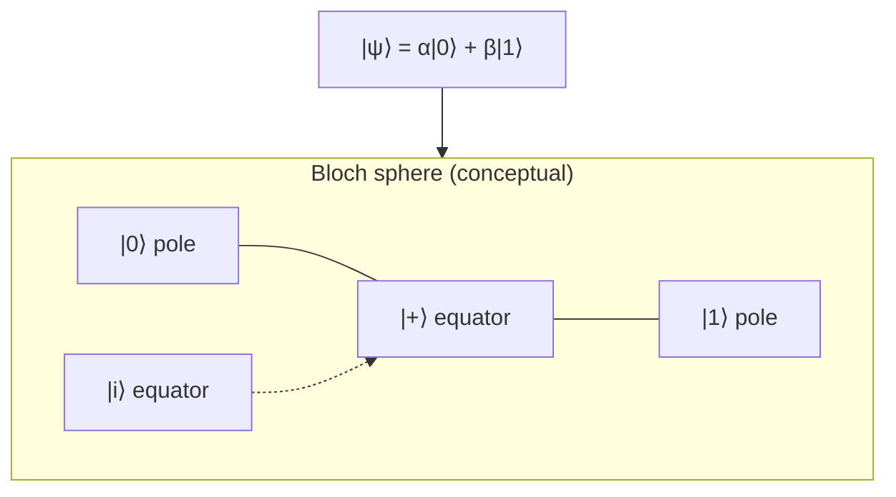

<TopicStudio studio="Quantum Studio" tagline="Interactive reference for quantum foundations">

<TopicNav title="Concepts">
  <TopicNavItem label="Superposition" subtitle="Qubit states" :active="true" color="#9b59b6" />
  <TopicNavItem label="Entanglement" subtitle="Correlated pairs" href="/blog/posts/quantum-entanglement" color="#e74c8c" />
  <TopicNavItem label="Measurement" subtitle="State collapse" color="#3498db" />
  <TopicNavItem label="Gates" subtitle="Unitary operations" color="#2ecc71" />
</TopicNav>

<TopicStage
  title="Superposition"
  subtitle="The foundation of quantum computing"
  tip="A qubit is not simply 0 or 1 — it exists in a combination of both until measured."
>

<template #diagram>

</template>

A **qubit** generalises the classical bit. Where a classical bit is either 0 or 1, a qubit can be in a *linear combination* of both basis states:

$$
|\psi\rangle = \alpha|0\rangle + \beta|1\rangle
$$

The coefficients $\alpha$ and $\beta$ are complex amplitudes. Measurement does not reveal them directly — it reveals **probabilities**:

$$
P(0) = |\alpha|^2 \quad,\quad P(1) = |\beta|^2
$$

Normalisation requires $|\alpha|^2 + |\beta|^2 = 1$. This is what makes superposition useful: a single qubit carries information about *both* outcomes simultaneously, and $n$ qubits can represent $2^n$ basis states at once.

</TopicStage>

<TopicNotes title="Key notes">

<TopicNote title="Amplitudes vs probabilities" tagline="What you compute vs what you observe">
- Amplitudes ($\alpha$, $\beta$) can interfere — probabilities cannot
- Only squared magnitudes are directly observable
- Phase differences matter for gate operations
</TopicNote>

<TopicNote title="Fun fact" variant="fact">
Schrödinger's cat is a macroscopic *thought experiment* about superposition — not a recipe for putting cats in boxes. The qubit version is experimentally real.
</TopicNote>

</TopicNotes>

<TopicFoot>

<TopicFootPanel title="Further reading">
- [Nielsen & Chuang — *Quantum Computation and Quantum Information*, Ch. 1](https://www.cambridge.org/core/books/quantum-computation-and-quantum-information/01E10196D0A682A6AEFFEA32D305BE0A)
- [IBM Quantum Learning — Superposition](https://learning.quantum.ibm.com/)
- [Qiskit Textbook — Representing Qubit States](https://qiskit.org/textbook/ch-states/representing-qubit-states.html)
</TopicFootPanel>

<TopicFootPanel title="Related">
- [Entanglement](/blog/posts/quantum-entanglement) — when two qubits share a single state
- [Quantum gates](/blog/posts/quantum-gates) — unitary operations that rotate amplitudes
- [Measurement](/blog/posts/quantum-measurement) — why observation changes the state
</TopicFootPanel>

</TopicFoot>

</TopicStudio>
