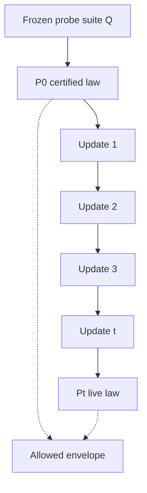
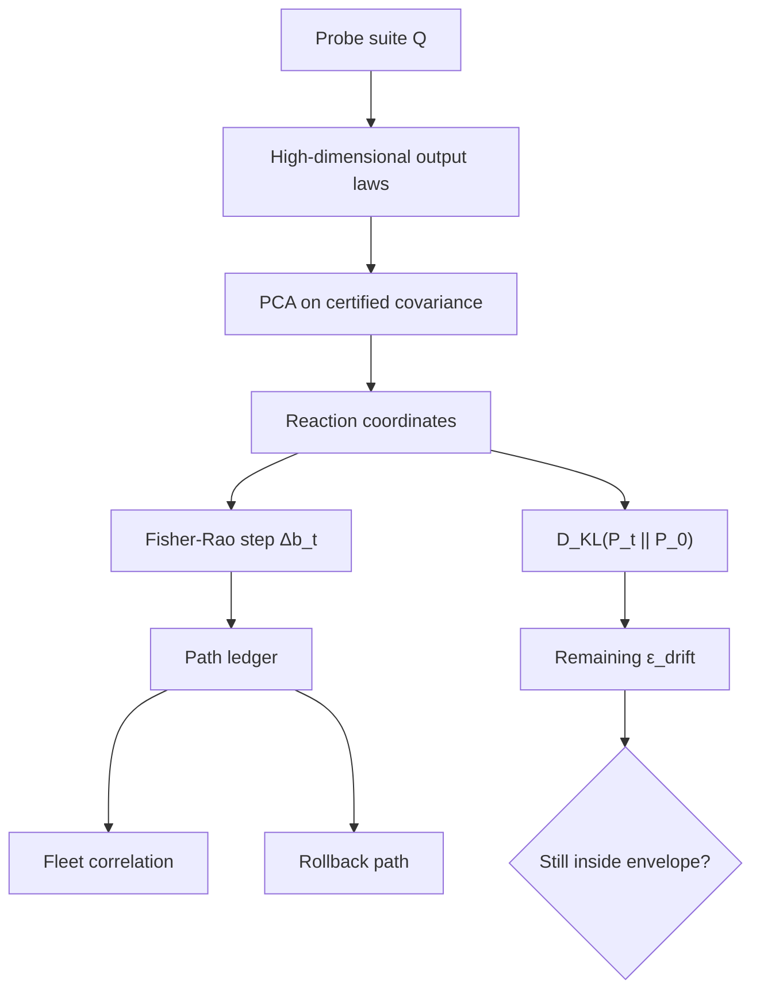
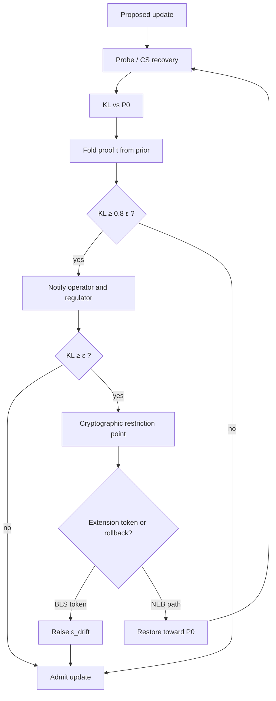
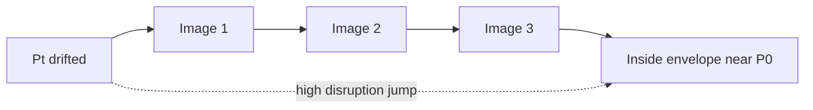

# The Certificate Is a Snapshot. Production Is a Path.

<TldrCard title="TL;DR" read-time="~14 min">

A certified AI system is a point in behaviour space. A production system is a trajectory. Continuous updates can walk that trajectory far from the certificate without anyone being able to prove, in real time, that the live system is still inside its certified envelope.

**RDCP** treats that gap as a budget, not a cliff. Probe the live system, project behaviour into a low-dimensional coordinate system, measure distance to the certified distribution with KL divergence on a Fisher–Rao manifold, accumulate a constant-size proof that the budget has not been spent, warn at 80%, and cryptographically refuse further updates when it is exhausted — unless a regulator issues a short pairing-based extension token, or the operator rolls back along a minimum-disruption path.

The hard claim is not that any one of these tools is new. It is that behavioural compliance can be *metered, attested, and gated* the way a privacy budget is spent — while the system stays online.

</TldrCard>

A certificate is issued against a frozen artefact: a model hash, a test report, a probe suite, a risk file, a date. Then the system is allowed to live.

Weights are patched. Retrieval corpora grow. Tool schemas change. Safety classifiers are swapped. Prompt templates are “improved.” Each change is locally reasonable. None of them, taken alone, looks like a recertification event. Together they can move the system into a behavioural regime that the original evaluation never saw.

That is the problem I want a name for, and a protocol for.

I am calling it **regulatory drift**. Not concept drift in the classical ML sense, and not merely “the model got worse.” Regulatory drift is *cumulative behavioural displacement relative to a certified envelope*, incurred by a live system that regulators cannot take offline in order to re-run the original campaign.

<PullQuote>

The cost of full recertification creates a perverse incentive: ship the update, hope the envelope still holds, and treat silence as compliance.

</PullQuote>

Differential privacy solved a related political-and-mathematical problem by giving privacy a number. Once you have $\varepsilon$, you can spend it, refuse to spend it, and audit the ledger. Certified AI has almost no equivalent. We have scorecards, red-team reports, and annual reviews. We do not have a live, cryptographically checkable statement of the form: *this system has not yet spent its behavioural allowance*.

The **Regulatory Drift Containment Protocol (RDCP)** is an attempt to define that allowance — and to make exceeding it a mechanical event rather than a narrative one.

<CrossIndustry
  title="Other regulated systems already refuse to treat a certificate as a permanent licence to change"
  from-label="Aviation, pharma, nuclear"
  to-label="Certified AI in production">
  <template #from>

An aircraft is not recertified from a blank page after every bolt. It is kept inside a continuous-airworthiness envelope: approved configuration, limiting conditions, and a paper trail for every deviation. A drug manufacturer uses comparability protocols so a process change can be shown, not hoped, to preserve the product. A nuclear plant has limiting conditions for operation — if you leave them, you do not keep running on optimism.

  </template>
  <template #to>

A foundation model, an agent, or a safety stack is often certified once, then updated weekly. There is no published drift budget, no live proof that the current output law is still close to the certified one, and no cryptographic stop when the distance is no longer defensible. RDCP is the missing envelope.

  </template>
</CrossIndustry>

<PartDivider eyebrow="Part I" title="Name the envelope before you measure the walk" />

## What, exactly, was certified?

If you cannot name a baseline distribution, you did not certify a behaviour. You certified a file.

RDCP starts from a deliberately operational definition. A **certified envelope** is not the model weights. It is the output law of the system on a frozen **probe suite** $\mathcal{Q}$:

$$
P_0(y \mid q) \quad \text{for } q \in \mathcal{Q}
$$

Probes are not unit tests. They are a designed sample of the behavioural manifold the regulator cares about: refusal boundaries, tool-authorization cases, clinical or credit decision templates, safety-critical edge prompts, and the boring in-distribution work the system was licensed to do. The artefact under certification is the pair $(\mathcal{Q}, P_0)$, plus the measurement protocol that produced $P_0$.

Every later system state $t$ induces a live law $P_t$. Drift is whatever takes $P_t$ away from $P_0$.

<AnnotatedFigure
  :number="1"
  caption="Certification captures a point. Operations generate a path. Recertification as a cliff ignores the path until it is already expensive."
  notice="The envelope is a region around P₀, not the weights. Updates that stay inside it should not require a full campaign. Updates that leave it should not be shippable on silence.">

</AnnotatedFigure>

That already changes the political geometry. An operator can no longer say “we only changed a LoRA.” A regulator can no longer say “bring the system down and run the original 14-week evaluation.” The question becomes: *how far has the live law moved, and who is allowed to let it move further?*

<StopAndAsk question="If you cannot point to the probe suite and the certified output law, what did the certificate actually bind — the model, or the press release?" />

<PartDivider eyebrow="Part II" title="Measure drift on a geometry that means something" />

## Project first. Distance is not Euclidean in 100,000 logits.

Raw output space is the wrong place to do regulation. Token distributions, tool-call payloads, and structured decisions live in a dimension so high that “the model moved 0.03 in L2” is not a sentence a regulator can act on.

RDCP therefore borrows a move that structural biology made decades ago. Protein conformation space is enormous. The chemically relevant motion lives on a few **reaction coordinates**. You find them by looking at the covariance of the motion you actually observe, not by staring at every atom.

### 1. Behavioural embedding via PCA

Collect, for each probe, a representation of the output law — class probabilities, refusal bits, tool-choice one-hots, calibrated scores. Form the covariance of those probe responses under $P_0$, and take the leading principal components. The live system is then tracked in that basis.

This is not a claim that the first $k$ eigenvectors *are* the safety-relevant directions. It is a claim that uncoordinated high-dimensional jitter should not spend the regulatory budget, and that coordinated motion along the dominant behavioural axes should. The certified PCA basis is part of the envelope. Changing the basis is itself a recertification event.

<AsideNote variant="note" title="What the protein-folding analogy is doing">

Energy-landscape projection does not prove that an LLM is a protein. It justifies a design choice: reduce the conformation space to coordinates in which motion is interpretable and budgetable. If a change is invisible in those coordinates, either it is small, or the probe suite is incomplete. Both facts are useful.

</AsideNote>

### 2. The drift budget is a relative-entropy ceiling

The budget itself is not Shannon entropy. Shannon entropy $H(P)$ measures surprise inside one distribution. What we need is *how much extra surprise the live system would impose on a regulator who still believes the certificate*.

That quantity is Kullback–Leibler divergence:

$$
\varepsilon_{\mathrm{drift}} \;\ge\; D_{\mathrm{KL}}(P_t \,\|\, P_0)
= \mathbb{E}_{y \sim P_t}\!\left[\log \frac{P_t(y)}{P_0(y)}\right]
$$

Call $\varepsilon_{\mathrm{drift}}$ the **regulatory drift budget**. It is an information-theoretic allowance: the live law may not become more than $\varepsilon_{\mathrm{drift}}$ nats more surprising, relative to the certified law, on the probe suite.

This is the closest analogue I can find to a differential-privacy $\varepsilon$ that still talks about *behaviour* rather than *adjacent datasets*. Privacy budgets limit how much a release can change under a neighbouring input. A drift budget limits how much a deployed system can change under a neighbouring *version*.

<PullQuote>

A certificate without a divergence ceiling is a photograph. A certificate with $\varepsilon_{\mathrm{drift}}$ is a licence with a remaining balance.

</PullQuote>

Two bookkeeping rules follow immediately, and they are easy to get wrong.

**Instantaneous KL is not additive.** $D_{\mathrm{KL}}(P_t \| P_0)$ is *not* the sum of the stepwise KLs along the update path. KL does not obey the triangle inequality. You cannot spend “0.1 nats per sprint” for ten sprints and conclude you are 1 nat from the certificate. The live budget check is always against $P_0$, or against a regulator-approved new baseline. Path sums are a different object.

**Decay must not hide the present.** Exponential forgetting is useful for *incident history* and for trend scores. It is illegitimate as a way to forgive a system that is still sitting far from $P_0$. If the current law is out of envelope, the half-life of last year’s patch is irrelevant.

### 3. The path lives on a statistical manifold

If stepwise motion needs a number — for fleet correlation, for rollback, for “how violently did this update move us” — Euclidean distance on probabilities is a poor one. The natural geometry of families of distributions is the **Fisher–Rao metric**. Locally,

$$
D_{\mathrm{KL}}(P_{\theta+\delta} \,\|\, P_\theta)
\;\approx\;
\tfrac{1}{2}\,\delta^\top I(\theta)\,\delta
$$

where $I(\theta)$ is the Fisher information. Each update’s behavioural displacement $\Delta b_t$ is then a **gradient-flow step** on that manifold: the direction and length of motion as seen by the output law, not as seen by the weight vector.

That is the geometric content of RDCP. Drift is not “the tensors changed.” Drift is movement along the curved surface of distributions the probes can see. Two fine-tunes that look similar in parameter space can be far apart on the manifold; two very different patches can be almost geodesically still. The manifold is the object the certificate should care about.

<AnnotatedFigure
  :number="2"
  caption="Measure in coordinates a regulator can budget: PCA reaction coordinates, Fisher–Rao path length, KL remaining balance against P₀."
  notice="Path length can accumulate. Remaining budget cannot be inferred from path length. Always recompute KL to the certified law.">

</AnnotatedFigure>

### 4. Do not probe all $n$ dimensions if the drift is sparse

Most updates do not move every behavioural axis. A retrieval change may shift citation behaviour and leave tool-authorization untouched. A refusal-policy patch may move a sparse subset of safety probes.

When the displacement is $k$-sparse in the probe (or PCA) basis, **compressed sensing** says you do not need $n$ evaluations. Under the usual restricted-isometry conditions, an $L_1$ / LASSO recovery from

$$
m = O\!\left(k \log \frac{n}{k}\right)
$$

random probe measurements identifies which coordinates moved. That is the Donoho–Candès theory applied to a regulatory job: sub-Nyquist sampling of behaviour, with a recovery guarantee when the sparsity assumption holds.

The operational consequence is real-time monitoring of large probe suites at a cost the platform can actually pay. The scientific consequence is that “we could not afford to check” stops being a respectable sentence — at least for sparse drift. Dense, coordinated motion still needs denser sampling. The protocol should detect that the sparsity assumption failed, not silently trust a sparse reconstruction.

### 5. Let old steps decay. Never let the current law decay.

Nuclear half-life is the right metaphor for the *ledger*, not for the *balance*.

$$
\tau = \frac{\ln 2}{\lambda}, \qquad
S_t = \sum_{k \le t} e^{-\lambda(t-k)}\,\lVert\Delta b_k\rVert
$$

$S_t$ is a discounted path score: useful for “are we in a season of violent updates?”, useful for fleet epidemiology, useless as a substitute for $D_{\mathrm{KL}}(P_t \| P_0)$. Radioactive decay describes a quantity that actually disappears. Present non-compliance does not disappear because the calendar moved.

<FailureMode
  name="Half-life washing"
  severity="high"
  symptom="Dashboards show a green remaining budget while live refusals, tool choices, or decision scores have already left the certified law."
  cause="Exponential weights were applied to the current KL instead of to historical step sizes. Ancient patches were forgotten, and so was the fact that the system never came back."
  fix="Separate the live envelope check (KL to P₀, no decay) from the path ledger (discounted Fisher steps). Only the ledger may forget." />

<PartDivider eyebrow="Part III" title="Prove it, warn at threshold, then refuse to replicate" />

## A budget that cannot be audited is a slogan.

Measurement without evidence is how compliance theatre is built. RDCP therefore treats every update cycle as a statement that must be proved, not a metric that must be trusted.

### 6. Fold the proof the way polymerase extends a strand

Re-proving the entire history at every release does not scale. The cryptographic primitive we want is already named in the literature: a **folding accumulation scheme** (Nova-style incrementally verifiable computation). Cycle $t$ produces a proof $\pi_t$ that:

1. the prescribed probes (or a compressed-sensing subset) were evaluated,
2. $P_t$ and $\Delta b_t$ were computed under the certified measurement protocol,
3. $D_{\mathrm{KL}}(P_t \| P_0) \le \varepsilon_{\mathrm{drift}}$,
4. $\pi_{t-1}$ was a valid predecessor.

The new proof *extends* the old one. It does not resynthesise the genome.

The biological analogy is DNA polymerase with 3′→5′ proofreading: each step reads the previous strand, adds a base, and checks. The regulatory analogy is a constant-size (or slowly growing) certificate of *continuous* airworthiness. A supervisor, a market regulator, or a downstream enterprise can verify $\pi_t$ without replaying a year of evaluations and without taking the model offline.

<AsideNote variant="caveat" title="What this proof does not say">

A folding proof attests to the measurement protocol you encoded. If the probe suite is incomplete, you will get a compact, elegant proof about the wrong envelope. Cryptography does not enlarge the semantics of $\mathcal{Q}$. It only makes lying about $\mathcal{Q}$ expensive.

</AsideNote>

### 7. Markov is an alarm bound, not a completeness theorem

The idea document proposed using Markov’s inequality as a guaranteed detector:

$$
\mathbb{P}\!\left(\sum_t \lvert\Delta b_t\rvert \gt \varepsilon_{\mathrm{drift}}\right)
\;\le\;
\frac{\mathbb{E}\!\left[\sum_t \lvert\Delta b_t\rvert\right]}{\varepsilon_{\mathrm{drift}}}
$$

Used carefully, this is a conservative **early-warning bound** on a non-negative accumulator when the live estimate is noisy. Used carelessly, it is a false completeness claim.

Markov does **not** give “no false-negative escapes.” It gives an upper bound on a tail probability, and the bound can be loose. The thing that actually prevents escape is the **hard gate** on measured $D_{\mathrm{KL}}(P_t \| P_0)$. Markov, Chernoff, or a simple running expectation can fire a *softer* alarm when the estimated spend is approaching the ceiling under uncertainty. That is worth having. It is not a substitute for the ceiling.

### 8. Warn like a neuron. Stop like a cell-cycle checkpoint.

Neurons do not linearly report membrane potential to the next cell. They integrate, and then they fire.

RDCP copies that control shape, with one important difference: the warning is not all-or-nothing even if the *gate* is.

- Below $0.8\,\varepsilon_{\mathrm{drift}}$: log, prove, continue.
- At $0.8\,\varepsilon_{\mathrm{drift}}$: **threshold potential** — notify the operator *and* the regulator. This is depolarisation, not yet the spike that stops the system.
- At $\varepsilon_{\mathrm{drift}}$: **restriction point**. Further model updates fail closed.

The restriction-point analogy is the G1/S checkpoint. A eukaryotic cell does not replicate DNA because it would like to. It replicates when the checkpoint proteins allow it. In RDCP the checkpoint is cryptographic: the update pipeline cannot commit a new artefact unless the current proof still shows residual budget, or a regulator token explicitly extends that budget.

<AnnotatedFigure
  :number="3"
  caption="Sense, fold, warn, gate. The live system stays up. The update pipeline does not."
  notice="Inference can continue inside the last admitted artefact. What is blocked is replication of a more drifted artefact — the cell-cycle move, not a crash-stop of the organism.">

</AnnotatedFigure>

This is a kinder operational story than “the AI is non-compliant, switch it off.” The last admitted, proved artefact can keep serving. What cannot happen is silent mitosis: copying a more drifted genome into production because the sprint ended on Friday.

### 9. Only the regulator mints more budget

When the envelope is genuinely too tight — new lawful use-cases, a better safety stack, a distribution shift in the world rather than in the model — someone has to move $P_0$ or raise $\varepsilon_{\mathrm{drift}}$. That someone should not be the operator.

RDCP mints **budget-extension tokens** as BLS signatures over bilinear pairings:

$$
e(g^a, g^b) = e(g, g)^{ab}
$$

The regulator holds the secret. The token binds `system_id`, the new ceiling or the new baseline hash, an expiry, and a nonce. Verification is short, aggregable, and unforgeable under the usual pairing assumptions. A smart-contract restriction point, or a more boring but equivalent policy engine with a pinned verifying key, will not accept an update that spends past $\varepsilon_{\mathrm{drift}}$ unless this token is present.

That is the political payload of the cryptography. Extensions are not a dashboard toggle. They are an issuance event.

<PartDivider eyebrow="Part IV" title="A fleet can catch fire. A rollback should not." />

## 10. Correlated drift is an epidemic, not a coincidence

One drifted assistant is an incident. A thousand assistants that moved in the same direction after the same vendor patch is a regulatory pathogen.

RDCP therefore watches **Pearson correlation** across the drift vectors of deployed systems:

$$
\rho_{ij}
= \frac{\mathrm{Cov}(\Delta b_i, \Delta b_j)}{\sigma_i \,\sigma_j}
$$

High $\rho$ after a shared update is the analogue of $R_0 > 1$: the same displacement is reproducing. The response is not the same as the per-system gate. It is a fleet action — freeze the shared component, demand a vendor proof, or require a regulator token at the source rather than at every leaf.

<AsideNote variant="note" title="What R₀ is doing here">

Epidemiology does not claim that models infect each other biologically. It claims that *shared updates are a transmission mechanism*. Correlation is how you see transmission without waiting for each local KL to exhaust on its own timetable.

</AsideNote>

## 11. Rollback is a path problem, not a `git revert`

Restoring compliance by snapping back to the certified checkpoint can be behaviourally violent. Users, tools, and downstream policies have adapted to the drifted state. The chemically literate version of this problem is finding a **minimum energy path** between two conformations.

The nudged elastic band (NEB) method places a chain of intermediate states between the current parameters (or current adapters, prompts, indexes — whatever the actual control surface is) and a state whose induced law is back inside the envelope. Springs keep adjacent images close. An “energy”

$$
E(\theta) = D_{\mathrm{KL}}(P_\theta \,\|\, P_0) + \lambda\,\mathrm{Disruption}(\theta, \theta_{\mathrm{now}})
$$

is minimised so that the path loses divergence with as little operational disruption as possible.

I want to be precise about the metaphor. NEB is not a training algorithm you paste onto an LLM tomorrow. It is a *control objective*: rollback should be optimised as a path, not as a jump. The images might be adapter checkpoints, policy versions, or retrieval pins rather than full weight tensors. The point is to refuse the false choice between “stay illegal” and “restore last year’s product in one shot.”

<AnnotatedFigure
  :number="4"
  caption="Minimum-energy rollback: a chain of states from the drifted law back into the envelope, not a discontinuous revert."
  notice="Each image must itself be measurable on the probe suite. A rollback path that cannot be probed is not a rollback path.">

</AnnotatedFigure>

<PartDivider eyebrow="Part V" title="What is actually new — and what must still be true" />

## Novelty is in the binding, not in the borrowed science

I do not need any of the source fields to be obscure for the protocol to be worth writing down. PCA, KL, Fisher geometry, folding proofs, BLS, Pearson, NEB, radioactive decay, and compressed sensing are all named because they are *known to work in their own domains*. The composition is the claim.

<PrincipleList title="Five bindings RDCP is trying to make">
  <Principle number="1" title="KL as a spendable compliance budget">
    Distributional distance is not a dashboard decoration. It is a ceiling with exhaustion, warning, and a refusal to mint further artefacts.
  </Principle>
  <Principle number="2" title="Folding proofs as polymerase">
    Continuous airworthiness of a live model should be a constant-size recursive attestation, not an annual campaign that requires downtime.
  </Principle>
  <Principle number="3" title="Fisher–Rao as the drift geometry">
    Parameter L2 and output L2 both lie. The manifold of probe-visible distributions is the space in which “how far did we move?” has meaning.
  </Principle>
  <Principle number="4" title="NEB as least-disruption restoration">
    Returning to the envelope is a path-optimisation problem. The legal jump and the operational jump are not the same curve.
  </Principle>
  <Principle number="5" title="Compressed sensing as the monitoring budget">
    Sparse behavioural change can be localised with O(k log n) probes. Real-time envelope checks stop being a computational excuse.
  </Principle>
</PrincipleList>

Those bindings only hold if several unglamorous things are true.

**The probe suite is the real specification.** If $\mathcal{Q}$ does not include the behaviours the public actually needs protected, RDCP will diligently protect the wrong object. Garbage-in, compact-proof-out.

**The measurement protocol is pinned.** Temperature, decoding, tool stubs, retrieval pins, and randomness all change $P_t$. A drift protocol that does not freeze the experimental method will measure noise and call it governance.

**Sparsity is checked, not assumed.** Compressed sensing fails open if the drift is dense. The protocol must fall back to denser sampling when reconstruction residual is high.

**The gate sits on artefact admission, not on a best-effort sidecar.** A proof that nobody checks is a blog post. The restriction point has to be on the path that can actually ship weights, adapters, prompts, or indexes.

**KL estimates need care in high dimension.** Naive plug-in KL on sparse histograms is biased. In practice one estimates on the PCA coordinates, uses a proper scoring rule, or bounds KL by a Fisher quadratic with empirical certificates. The protocol is only as strong as this estimator.

<FailureMode
  name="Certified probes, uncertified world"
  severity="high"
  symptom="Proofs remain green while users hit behaviours the suite never named — new tools, new languages, new populations, new jailbreaks."
  cause="The envelope was defined on last year's questions. The world moved, the probes did not, and the folding scheme honestly attested to an obsolete Q."
  fix="Treat probe-suite revision as a first-class recertification of P₀. Fleet correlation and residual-based sensing are hints that Q is stale — they are not a substitute for enlarging Q." />

<BeforeAfter
  title="What changes if we take the envelope seriously"
  before-label="Today"
  after-label="With a drift budget">
  <template #before>

Ship the patch. Point at the last certificate. Recertify when someone forces a downtime campaign. Treat “no incident yet” as evidence of remaining envelope. Let vendors update a thousand deployments with no view of correlated motion.

  </template>
  <template #after>

Every admitted artefact spends a measured, proved amount of $\varepsilon_{\mathrm{drift}}$. At 80% the regulator is in the room. At 100% mitosis stops. More budget is an issuance event. Rollback is a designed path. A fleet that moves together is treated as one incident.

  </template>
</BeforeAfter>

## What I am not claiming

I am not claiming that RDCP is implemented, standardised, or sufficient. I am not claiming that Markov’s inequality abolishes missed detections. I am not claiming that a bilinear pairing makes a probe suite complete. I am not claiming that NEB on a 70B-parameter manifold is a weekend project.

I am claiming that *certified AI has been missing a quantity*.

Without a quantity, every update is either “too small to matter” or “large enough to panic,” and the organisation will always prefer the first sentence. With a quantity, you can do the boring, adult things regulated industries already know how to do: meter, attest, warn, stop, extend, and restore.

<PullQuote>

If a live system cannot say how much certified behaviour it has spent, it is not continuously compliant. It is continuously unverified.

</PullQuote>

The research programme from here is concrete. Pin a probe suite and a measurement protocol. Estimate $P_0$. Put the live law in a certified PCA basis. Compute KL and Fisher steps that a third party can reproduce. Fold those claims. Put the verifying key on the only path that can admit an artefact. Watch the fleet’s $\rho$. When the budget is gone, refuse to replicate until a regulator token or a probed rollback path says otherwise.

That is not a full science of AI certification. It is a way to stop pretending that a snapshot can govern a trajectory.
