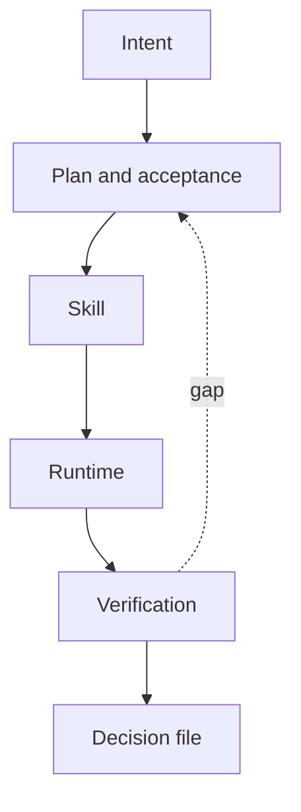

# The Prompt Is Not the System

<TldrCard title="TL;DR" read-time="~8 min">

A 2026 agent system is a harness: a repository the agent can read, a procedure small enough to trigger, and a check that can fail the run. Cursor and Codex should sit on that tree. The prompt is an input.

</TldrCard>

I have been reading Codex, Cursor, and Spec Kit the way I read a factory. The useful question is what has to exist around the model so that research, architecture, a patent note, an MCP server, or a document can come back as work I will own next week.

The demo diagram is still `user → agent → tools → done`. The diagram that survives a second session is longer, and most of it is files.

```text
intent → relevant context → plan with a finish line
      → skill → tool or MCP → isolated runtime
      → a check the author does not sign
      → a file the next run can open
```

<PullQuote>

Do not ask the agent to remember your architecture. Build an environment in which violating it is difficult and detectable.

</PullQuote>

I have made this argument in pieces before. A [central supervisor](/blog/posts/2026-05-08-central-supervisor-agent-techncial-debt) becomes debt once policy, memory, and sign-off live in one loop. [Coding assistants](/blog/posts/2026-05-19-good-old-engineering) made it cheap to skip the engineering, not optional. A [guardrail classifier](/blog/posts/2026-09-04-guardrail-harness) is a detector until it can refuse an action. Same missing object here: the boundary, the evidence, the refusal.

<PartDivider eyebrow="Part I" title="The repository has to be able to refuse" />

## What the Codex experiment changed

On 11 February 2026 Ryan Lopopolo wrote up a five-month internal build. A small team shipped a product whose code, tests, CI, docs, and tooling were generated by Codex. Humans steered. The scarce resource they name is attention, spent on the environment.

Five practices are worth keeping. I am not adopting their “no lines by hand” rule. That was the experiment. Patent work and architecture work still need a human on the claim.

They made the repository the record. Design notes, architecture, quality grades, and execution plans sit beside the code. A chat, a slide, or a decision in someone’s head is invisible to the next agent, the way it would be invisible to a new hire.

They kept `AGENTS.md` to about a hundred lines and used it as a table of contents into `docs/`. A giant instruction file crowds out the task, rots, and cannot be linted. Agents open the deeper file when the task needs it.

They made the running system lookable. The app booted per worktree. The agent could read the DOM, logs, and metrics for that worktree. “It should work” stopped being the test.

They made architecture fail the build. Inside a domain, dependencies move only forward — Types, Config, Repo, Service, Runtime, UI — and cross-cutting concerns enter through one provider edge. Custom lints say how to fix the violation. When a prose rule keeps being missed, it becomes a lint.

They stopped spending Fridays on “AI slop.” Background tasks scan for drift against a few golden principles and open small pull requests. Agents copy whatever is already in the tree, including the bad patterns. Cleanup has to be a job, or the bad pattern becomes the style.

<AsideNote variant="caveat" title="What that write-up does not license">

OpenAI says the end-to-end behaviour depends on that repository and should not be assumed to travel. A million generated lines is evidence that the harness was the work.

</AsideNote>

<AnnotatedFigure
  :number="1"
  caption="A gap goes back to the plan. The chat is not the record."
  notice="If the session vanished, the next agent needs the decision file, not the transcript.">



</AnnotatedFigure>

Spec Kit’s public flow is the same shape with the steps named: constitution, specify, clarify, plan, checklist, tasks, analyse, implement, **converge**. Converge is append-only. It compares the tree to the spec and adds tasks. It does not congratulate the implementation. Their idea-assessment path can end in go, needs-clarification, or kill, and a kill does not start coding. That matches the work I do before a repository exists.

<PartDivider eyebrow="Part II" title="A skill is how. A server is what answers." />

## Keep the procedure out of the tool

OpenAI’s plugin notes say to put the workflow in the skill and the live data, auth, and side effects in the server. Cursor shows the agent the skill’s name and description first. The body loads when the task matches. The description is the routing contract. A vague one misses, or it fires on the neighbouring task and scaffolds the wrong artefact.

```text
patent-novelty-analysis/          patent-search server
  SKILL.md                          search_prior_art()
  references/novelty-rubric.md      get_patent()
  references/claim-chart.md         lookup_classification()
```

The skill says: search, cluster, compare, try to break the claim, write the evidence table, then send it to a critic. The server returns documents. The skill does not invent a patent it did not retrieve. The server does not contain an essay on how I like claims written. Those fail differently, and they should be tested differently.

The front door I will hard-code is small:

```text
WORK      research · code · architecture · document · operations
RISK      read-only · write repo · external · credentialed · destructive
ARTEFACT  code · ADR · patent note · MCP · diagram
```

Risk is the deterministic part. “The model will probably not delete the remote” is not a control. Work and artefact only decide which skill descriptions to show. OpenAI’s skill evals target the seam that matters: failed trigger, eager trigger, skipped step, unwanted file. Those regressions belong next to the skill.

A workflow is a composition, not another skill. `prior-art-research` and `claim-mapping` stay reusable. `idea-to-patent` is the recipe that calls them and names the file each step must leave.

Subagents are for a polluted context: a literature pass, a long log, a hostile read. They return findings. `patent-analysis` and `architecture-design` are skills. Six agents with six copies of my taste is the supervisor again, with new job titles.

Cursor’s project coordinator is useful because it plans and delegates and is not supposed to write the code. It stays useful only while policy and proof stay in the repository. If the coordinator is also the constitution and the sign-off, the control plane is back.

<PartDivider eyebrow="Part III" title="Done is a second instrument" />

## The author does not sign the review

Generation, criticism, and evidence in one window will agree. Disagreement is the point.

A lint or a schema catches dependency direction, a missing citation, a path outside the allowed set. The error text has to say the fix. “Architecture” will be repaired by a rename.

A critic in another context tries to break the claim: the novelty, the dependency, the citation that was never opened. That is the same split as author and reviewer in [SDD++](/blog/posts/2026-05-22-sdd-plus-system-overview).

Evidence is a file a third person can open. A UI change points at a snapshot. A patent row points at the claim and the passage. The Codex team made logs and the running UI available so “under 800ms” could be measured. The personal version is smaller: every non-trivial deliverable names the check that would show it is wrong.

Cursor hooks can see the prompt, a file read, an edit, a shell command, an MCP call, a subagent, and completion. That is the right place for “no write outside these paths” and “no finish while the verification note is empty.” The IDE fires that set. CLI and cloud have lagged it. A control I need on every surface belongs in CI, with the hook as the local copy.

<FailureMode
  name="The author signs the review"
  severity="high"
  symptom="A confident summary, tests not run, citations that point at titles."
  cause="Draft, critique, and evidence shared one context."
  fix="Another context for the critic. A note of commands, outputs, and open gaps before the run can close." />

## One tree

I am not building an orchestrator for this. Cursor and Codex already read a `SKILL.md`. They can both be pointed at one tree. `.governance/` stays the constitution. The missing objects are procedures, recipes, and tests for those procedures.

```text
AGENTS.md                 map, about a hundred lines
.governance/              principles, decisions, progress
skills/                   one procedure each, plus a rubric
workflows/                which skills, which file each step leaves
evals/                    must trigger, must not, must emit
agents/                   reviewer and verifier only
hooks/                    edit, shell, MCP, finish
```

`AGENTS.md` points at the principles. It does not restate them. An eval sits beside the skill. On a cadence, delete the instruction that has not changed a decision in months. The Codex team’s doc-gardening exists because a manual that only grows becomes noise. A stronger model makes stale warnings heavier, not cheaper.

<PullQuote>

A prompt can ask for a system. The harness is what is still there when the prompt is gone.

</PullQuote>

This tree is not built. The first slice is one skill, one eval, and a verification note a session cannot skip.

## Sources

- Ryan Lopopolo, [Harness engineering](https://openai.com/index/harness-engineering/), OpenAI, 11 February 2026.
- Cursor: [Projects](https://cursor.com/docs/agent/projects), [Subagents](https://cursor.com/docs/subagents), [Skills](https://cursor.com/docs/skills), [Hooks](https://cursor.com/docs/hooks).
- OpenAI: [Skills](https://developers.openai.com/codex/skills), [Build skills](https://developers.openai.com/plugins/build/skills), [Skill evals](https://developers.openai.com/blog/eval-skills).
- Spec Kit: [Quickstart](https://github.github.io/spec-kit/quickstart.html), [Idea assessment](https://github.github.io/spec-kit/guides/assessment.html).
